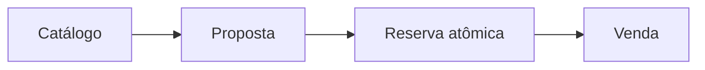

# Maikeise MotoHub

Estudo de produto, DDD e arquitetura para uma possível plataforma web de gestão comercial de motocicletas, do catálogo à venda, atendendo clientes pessoa física e jurídica.

> [!IMPORTANT]
> Este projeto está **em pausa** após a conclusão do seu ciclo de ideação, DDD e arquitetura inicial. O objetivo principal desta etapa foi estudar modelagem de software; não existe aplicação implementada. Uma futura implementação continua possível, mas dependerá de novas revisões de planejamento.

[Consulte o registro de encerramento desta etapa](docs/09-project-status.md).

## O projeto em um minuto

| Pergunta | Resposta |
| --- | --- |
| Qual problema pretende resolver? | Centralizar catálogo, clientes, propostas, reservas e vendas, reduzindo conflitos e perda de histórico. |
| Quem utiliza? | Visitantes, clientes PF, representantes de empresas e funcionários da concessionária. |
| Qual é o diferencial estudado? | Propostas versionadas, aprovação de descontos, reserva atômica de unidades e rastreabilidade das decisões. |
| Qual é o escopo inicial? | Uma concessionária, pagamento externo e aplicação web responsiva. |
| Qual é a abordagem? | DDD estratégico e tático, seguido de monólito modular com Arquitetura Hexagonal. |
| Em que fase está? | Modelagem e arquitetura inicial concluídas; projeto pausado antes do início do código. |

## Fluxo principal

O visitante consulta unidades físicas específicas. Depois de se cadastrar, solicita uma proposta. O vendedor prepara uma versão com preço e desconto; descontos acima de 10% exigem aprovação do gerente. O aceite dispara uma tentativa de reserva de todas as unidades e, após a confirmação do pagamento externo, a venda é concluída.

### Regras que orientam o modelo

| Tema | Decisão do MVP |
| --- | --- |
| Proposta | Vale sete dias e preserva todas as versões enviadas. |
| Desconto | Vendedor concede até 10%; acima disso, a versão exata exige aprovação gerencial. |
| Reserva | Todas as unidades são reservadas juntas ou nenhuma delas é. |
| Prazo | 48 horas, com uma única prorrogação gerencial de 24 horas. |
| Concorrência | Uma unidade nunca participa de duas reservas ativas. |
| Pagamento | Acontece fora da plataforma e é confirmado por funcionário autorizado. |
| Cancelamento de venda | Preserva o histórico e envia as unidades para revisão. |

## Por que este projeto existe

O Maikeise MotoHub é um estudo individual e uma peça de portfólio inspirada pelo domínio discutido em um trabalho acadêmico coletivo. Ele não representa a entrega oficial da equipe e não reutiliza código, nome ou identidade visual daquele projeto.

Neste ciclo individual, a proposta foi aprofundar a ideação acadêmica e documentar o raciocínio de produto, DDD e arquitetura. A intenção inicial incluía Java, Spring Boot e deploy local, mas o estudo foi encerrado na modelagem para permitir foco em outros projetos. Essa implementação poderá ser retomada depois de uma nova revisão.

[Entenda a origem, a autoria e os limites entre os projetos](docs/00-project-context.md).

## Uso transparente de IA

Durante esta etapa, usei o ChatGPT/Codex, da OpenAI, para estudar conceitos, organizar ideias, levantar perguntas, revisar inconsistências e automatizar parte do backlog. Esse processo também serviu como um estudo prático sobre a eficácia e os limites da IA na modelagem de software.

As decisões não foram delegadas à ferramenta. Eu revisei e aprovei o que entrou no projeto. Como o código não foi iniciado, a modelagem foi avaliada por coerência e rastreabilidade documental, mas ainda não foi comprovada por implementação ou testes.

[Veja o registro completo do uso de IA, das validações e dos limites observados](docs/08-ai-assisted-development.md).

## Decisões de modelagem e arquitetura

- Seis Bounded Contexts com responsabilidades e dados próprios.
- Onze Aggregate Roots e invariantes associadas aos objetos que as protegem.
- Referências entre agregados por IDs tipados, sem grafos de entidades entre módulos.
- Repositórios somente para Aggregate Roots.
- Catálogo separado do estoque operacional.
- Estoque e reservas no mesmo contexto para proteger a exclusividade das unidades.
- Monólito modular aceito, com Arquitetura Hexagonal dentro de cada módulo.
- Microsserviços somente quando houver uma necessidade demonstrável de implantação ou escala independente.

> [!NOTE]
> Evento de domínio não significa Event Sourcing, e Bounded Context não significa microsserviço. Essas separações são intencionais e estão explicadas na documentação.

[Conheça a arquitetura](docs/architecture/00-overview.md) ou consulte a decisão formal na [ADR-001](docs/architecture/decisions/ADR-001-monolito-modular-arquitetura-hexagonal.md).

## Escolha uma trilha de leitura

| Se você é... | Comece por... | Tempo aproximado |
| --- | --- | ---: |
| Recrutador(a) | Este README, o [resumo do DDD](docs/ddd/00-overview.md) e a [visão arquitetural](docs/architecture/00-overview.md) | 12 min |
| Professor(a) | [Contexto acadêmico](docs/00-project-context.md), [visão do produto](docs/01-product-vision.md), [resumo do DDD](docs/ddd/00-overview.md) e [ADR-001](docs/architecture/decisions/ADR-001-monolito-modular-arquitetura-hexagonal.md) | 20 min |
| Pessoa desenvolvedora | [Hub da documentação](docs/README.md), seguido dos documentos técnicos numerados | 30+ min |
| Autora estudando o projeto | [Hub da documentação](docs/README.md) e as seções “O que registrar no caderno” | Conforme a etapa |

Toda a navegação está organizada no [Hub da documentação](docs/README.md).

## Progresso

| Etapa | Situação |
| --- | --- |
| Linguagem ubíqua | ✅ Concluída |
| Subdomínios | ✅ Concluída |
| Bounded Contexts | ✅ Concluída |
| Context Map | ✅ Concluída |
| Eventos de domínio | ✅ Concluída |
| Agregados e invariantes | ✅ Concluída |
| Decisão arquitetural inicial | ✅ Concluída |
| Encerramento do ciclo de modelagem | ✅ Concluído |
| Fundação Spring Boot | ⏸️ Pausada antes do início |
| Implementação Spring Boot | 🔮 Possibilidade futura |
| Interface e deploy local | 🔮 Possibilidade futura |

## Tecnologias consideradas para uma futura implementação

<strong>Ver stack técnica</strong>

- Java 21 e Spring Boot 4.1.
- Spring Modulith e Spring Security.
- PostgreSQL e Flyway.
- JUnit, Mockito e Testcontainers.
- Docker e Docker Compose.
- REST com OpenAPI.
- Interface web com Thymeleaf e HTMX.

> [!NOTE]
> Esta stack registra a direção estudada em setembro de 2026. Versões e escolhas deverão ser reavaliadas antes de qualquer implementação.

## Escopo futuro

<strong>O que foi deixado conscientemente fora do MVP</strong>

- Pagamento online.
- Multi-tenancy para várias concessionárias.
- Emissão fiscal e financiamento bancário reais.
- Oficina, trade-in, seguros e garantias.
- Telemetria e aplicativo móvel nativo.

## Autoria e licença

Esta etapa do estudo individual foi desenvolvida por [ANNY MAIKEISE](https://github.com/notmaikeise), preservando o reconhecimento da inspiração acadêmica coletiva.

A licença será definida antes da primeira versão pública de código.
