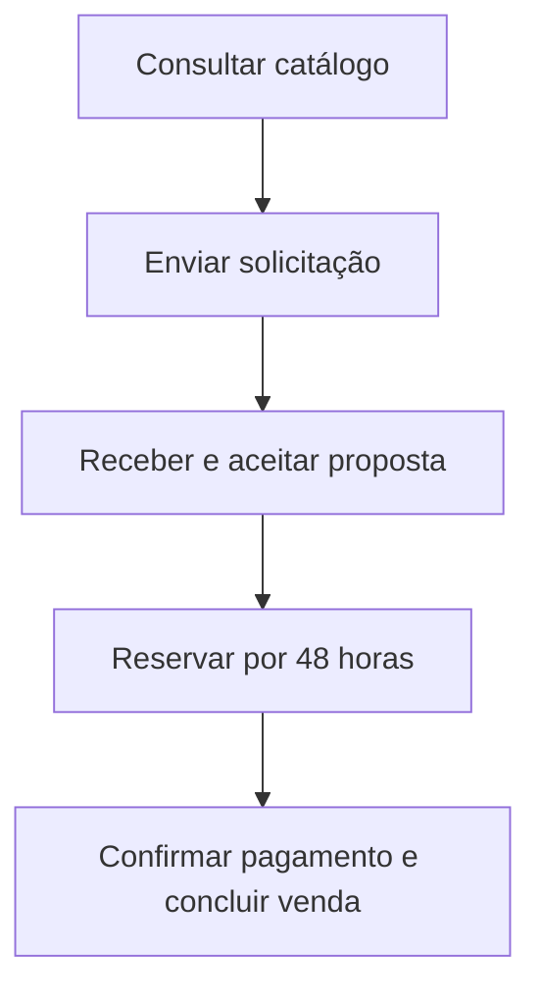

# Jornada principal do cliente

> [!TIP]
> Leia primeiro o fluxo principal. Os caminhos de erro e exceção ficam recolhidos logo abaixo para não interromper a narrativa.

## Premissas

- O catálogo pode ser consultado sem autenticação.
- O cliente precisa possuir conta com e-mail confirmado e cadastro comercial habilitado para enviar uma solicitação de proposta.
- Uma reserva somente pode ser criada depois do aceite de uma proposta válida.
- O aceite dispara automaticamente uma tentativa de reserva integral das unidades.
- O pagamento acontece fora da plataforma no MVP.
- A venda é concluída após um funcionário registrar a confirmação do pagamento.

## Fluxo principal

1. O visitante acessa o catálogo.
2. Pesquisa e filtra as unidades disponíveis.
3. Consulta os detalhes e o preço anunciado de uma unidade específica.
4. Seleciona uma ou mais unidades e inicia uma solicitação de proposta.
5. Entra em uma conta existente ou cria um cadastro PF ou PJ.
6. Quando a conta for nova, confirma o e-mail e completa os dados mínimos.
7. Confirma as unidades específicas desejadas e envia a solicitação.
8. O vendedor analisa a solicitação e prepara a proposta.
9. Quando necessário, o gerente analisa descontos acima de 10%.
10. O vendedor envia a proposta com validade de sete dias.
11. O cliente consulta e aceita a proposta.
12. O sistema tenta criar a reserva automaticamente.
13. O sistema verifica novamente e em conjunto a disponibilidade de todas as unidades.
14. Se todas estiverem disponíveis, confirma a reserva por 48 horas.
15. O cliente realiza o pagamento fora da plataforma.
16. Um funcionário registra a forma de pagamento e sua confirmação externa.
17. O vendedor ou gerente conclui a venda.
18. O sistema registra a venda e altera as unidades para `VENDIDA`.

<strong>Fluxos alternativos e exceções</strong>

## Fluxos alternativos

### Unidade indisponível

Se uma unidade deixar de estar disponível antes da reserva, o sistema rejeita toda a tentativa. Nenhuma das demais unidades é bloqueada, e o vendedor pode preparar uma nova versão para outro conjunto disponível.

### Desconto acima da alçada

Se o desconto superar 10%, a proposta aguarda análise gerencial e não pode ser enviada antes da decisão.

### Proposta recusada

O cliente pode recusar a proposta. O fluxo termina sem criar uma reserva.

### Proposta expirada

Depois de sete dias, a proposta expira e não pode ser aceita ou usada em uma reserva.

### Reserva cancelada

O cliente ou um funcionário autorizado cancela a reserva. As unidades voltam a ficar disponíveis, caso não exista outro impedimento.

### Reserva expirada

Se a venda não for confirmada em 48 horas, a reserva expira e as unidades são liberadas. O gerente pode conceder uma única prorrogação de 24 horas antes do vencimento, com justificativa.

### Pagamento não confirmado

Sem a confirmação externa do pagamento, o sistema não permite concluir a venda.

### Cliente bloqueado

Um cliente bloqueado comercialmente não inicia novas negociações. Propostas e reservas existentes são encaminhadas para análise e não são apagadas nem canceladas automaticamente.

### Venda cancelada

O gerente pode cancelar uma venda com justificativa. A venda original permanece no histórico e suas unidades mudam para `EM_REVISAO`; elas somente voltam a `DISPONIVEL` depois de uma liberação explícita.

[Voltar ao Hub da documentação](README.md).
