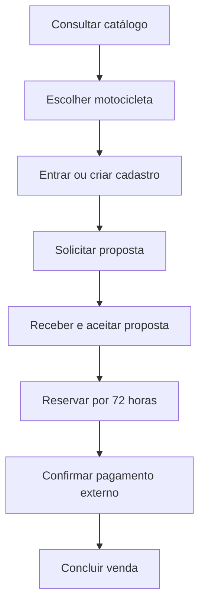

# Jornada principal do comprador

## Premissas

- O catálogo pode ser consultado sem autenticação.
- O comprador precisa entrar ou criar uma conta para solicitar uma proposta.
- Uma reserva somente pode ser criada depois do aceite de uma proposta válida.
- O pagamento acontece fora da plataforma no MVP.
- A venda é concluída após um funcionário registrar a confirmação do pagamento.

## Fluxo principal

1. O visitante acessa o catálogo.
2. Pesquisa e filtra as motocicletas.
3. Consulta os detalhes de uma unidade disponível.
4. Solicita uma proposta.
5. Entra em uma conta existente ou cria um cadastro PF ou PJ.
6. Confirma as motocicletas desejadas e envia a solicitação.
7. O vendedor analisa a solicitação e prepara a proposta.
8. Quando necessário, o gerente analisa descontos acima de 10%.
9. O vendedor envia a proposta com validade de sete dias.
10. O comprador consulta e aceita a proposta.
11. O comprador solicita a reserva.
12. O sistema verifica novamente a disponibilidade das unidades.
13. O sistema confirma a reserva por 72 horas.
14. O comprador realiza o pagamento fora da plataforma.
15. Um funcionário registra a confirmação do pagamento.
16. O vendedor ou gerente conclui a venda.
17. O sistema registra a venda e altera as unidades para `VENDIDA`.

## Fluxos alternativos

### Motocicleta indisponível

Se uma unidade deixar de estar disponível antes da reserva, o sistema rejeita a solicitação e orienta o comprador a pedir uma proposta revisada.

### Desconto acima da alçada

Se o desconto superar 10%, a proposta aguarda análise gerencial e não pode ser enviada antes da decisão.

### Proposta recusada

O comprador pode recusar a proposta. O fluxo termina sem criar uma reserva.

### Proposta expirada

Depois de sete dias, a proposta expira e não pode ser aceita ou usada em uma reserva.

### Reserva cancelada

O comprador ou um funcionário autorizado cancela a reserva. As unidades voltam a ficar disponíveis, caso não exista outro impedimento.

### Reserva expirada

Se a venda não for confirmada em 72 horas, a reserva expira e as unidades são liberadas.

### Pagamento não confirmado

Sem a confirmação externa do pagamento, o sistema não permite concluir a venda.
