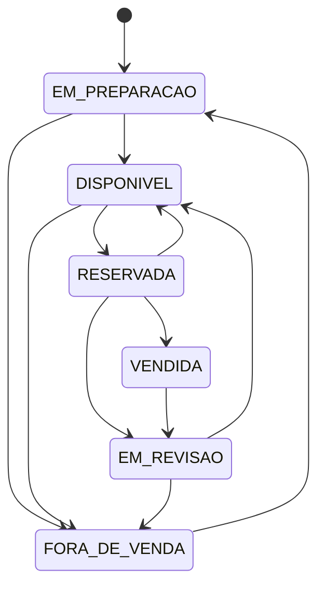

# Regras de negócio

## Convenção

As regras seguem o padrão `RN-ÁREA-NÚMERO`.

| Código | Área |
| --- | --- |
| `CLI` | Clientes |
| `MOT` | Motocicletas e estoque |
| `CAT` | Catálogo e anúncios |
| `PRO` | Solicitações e propostas |
| `RES` | Reservas |
| `VEN` | Vendas |
| `ACE` | Acesso |
| `NOT` | Notificações |
| `AUD` | Auditoria |

## Clientes

| Código | Regra |
| --- | --- |
| RN-CLI-001 | Todo cliente deve ser cadastrado como pessoa física ou pessoa jurídica. |
| RN-CLI-002 | Um cliente pessoa física deve possuir um CPF matematicamente válido. |
| RN-CLI-003 | Um cliente pessoa jurídica deve possuir um CNPJ matematicamente válido. |
| RN-CLI-004 | Não pode existir mais de um cliente com o mesmo CPF ou CNPJ. |
| RN-CLI-005 | Todo cliente PF e todo representante deve utilizar uma conta de acesso individual. |
| RN-CLI-006 | Uma pessoa jurídica deve possuir pelo menos um representante responsável. |
| RN-CLI-007 | Somente clientes ativos podem solicitar propostas e possuir novas reservas criadas. |
| RN-CLI-008 | A inativação de um cliente não apaga seu histórico de propostas, reservas e vendas. |
| RN-CLI-009 | O MVP valida formato e dígitos de CPF e CNPJ sem consultar serviços externos. |
| RN-CLI-010 | Um cliente PF precisa ter pelo menos 18 anos para ser habilitado para operações comerciais no MVP. |
| RN-CLI-011 | O e-mail da conta precisa estar confirmado antes da habilitação comercial. |
| RN-CLI-012 | Um cliente PF precisa informar nome completo, CPF, data de nascimento e telefone; um cliente PJ precisa informar razão social, CNPJ, telefone e ao menos um representante. |
| RN-CLI-013 | O cliente pode atualizar dados comuns, mas não pode alterar diretamente o próprio CPF ou CNPJ. |
| RN-CLI-014 | A correção de CPF ou CNPJ exige gerente, motivo obrigatório e preservação do valor anterior para auditoria. |
| RN-CLI-015 | O bloqueio comercial impede novas propostas e reservas, mas não apaga nem cancela automaticamente operações existentes. |
| RN-CLI-016 | Propostas e reservas abertas de um cliente bloqueado são encaminhadas para análise gerencial. |

## Motocicletas e estoque

### Modelo e unidade

Um **modelo de motocicleta** descreve um produto genérico, como marca, modelo, versão e especificações. Uma **unidade de estoque** representa uma motocicleta física específica, identificada pelo chassi e escolhida individualmente pelo cliente.

| Código | Regra |
| --- | --- |
| RN-MOT-001 | Toda unidade deve estar vinculada a um modelo cadastrado. |
| RN-MOT-002 | Cada unidade deve possuir um número de chassi único. |
| RN-MOT-003 | O número do motor deve ser único quando informado. |
| RN-MOT-004 | A placa deve ser única quando informada. |
| RN-MOT-005 | Uma nova unidade entra no estoque com status `EM_PREPARACAO`. |
| RN-MOT-006 | A unidade somente muda de `EM_PREPARACAO` para `DISPONIVEL` após a confirmação da preparação pelo responsável. |
| RN-MOT-007 | Somente uma unidade `DISPONIVEL` pode ser escolhida para uma nova solicitação de proposta. Uma unidade `RESERVADA` pode permanecer visível, mas não selecionável. |
| RN-MOT-008 | Uma unidade `RESERVADA` não pode ser incluída em outra proposta ou reserva. |
| RN-MOT-009 | Uma unidade `VENDIDA` não pode voltar ao estoque por uma edição comum. |
| RN-MOT-010 | Uma unidade `FORA_DE_VENDA` não pode ser selecionada no catálogo dos clientes. |
| RN-MOT-011 | Uma unidade com histórico comercial não pode ser apagada definitivamente. |
| RN-MOT-012 | A retirada de venda preserva todo o histórico da unidade. |
| RN-MOT-013 | O preço anunciado de uma unidade disponível deve ser maior que zero. |
| RN-MOT-014 | O ano de fabricação não pode ser posterior ao próximo ano-calendário. |
| RN-MOT-015 | Toda alteração de status registra data, horário e conta responsável. |
| RN-MOT-016 | Cada unidade física aparece separadamente no catálogo, mesmo quando existem unidades do mesmo modelo. |
| RN-MOT-017 | O cancelamento de uma venda muda suas unidades de `VENDIDA` para `EM_REVISAO`, nunca diretamente para `DISPONIVEL`. |
| RN-MOT-018 | Uma unidade `EM_REVISAO` somente volta a `DISPONIVEL` após liberação explícita de funcionário autorizado. |
| RN-MOT-019 | Uma unidade reprovada na revisão muda para `FORA_DE_VENDA`. |

### Status de uma unidade

```text
EM_PREPARACAO
DISPONIVEL
RESERVADA
VENDIDA
EM_REVISAO
FORA_DE_VENDA
```

### Transições permitidas inicialmente



O cancelamento de uma venda é uma ação compensatória gerencial. A venda permanece no histórico e a unidade precisa passar por revisão antes de uma possível nova disponibilização.

## Catálogo e anúncios

| Código | Regra |
| --- | --- |
| RN-CAT-001 | Todo anúncio representa uma unidade de estoque específica por meio de `unitId`. |
| RN-CAT-002 | O vendedor pode criar e editar anúncios em rascunho. |
| RN-CAT-003 | Somente gerente ou administrador pode publicar anúncio e alterar o preço oficial. |
| RN-CAT-004 | Um anúncio somente pode ser publicado como disponível quando a unidade estiver `DISPONIVEL` e o preço for maior que zero. |
| RN-CAT-005 | Uma unidade reservada permanece visível como `RESERVADA`, mas não pode ser selecionada para outra negociação. |
| RN-CAT-006 | A liberação da reserva reativa o anúncio quando não existe outro impedimento. |
| RN-CAT-007 | A venda arquiva o anúncio sem apagar seu histórico. |
| RN-CAT-008 | Inventory and Reservation é a fonte oficial da situação operacional; o catálogo mantém somente sua representação pública. |

## Solicitações e propostas

| Código | Regra |
| --- | --- |
| RN-PRO-001 | Toda solicitação de proposta deve estar vinculada a um único cliente ativo. |
| RN-PRO-002 | Uma solicitação de proposta deve conter uma ou mais unidades específicas escolhidas pelo cliente. |
| RN-PRO-003 | A solicitação demonstra interesse comercial, mas não constitui uma oferta e não reserva unidades. |
| RN-PRO-004 | Uma proposta é preparada por um vendedor para um único cliente a partir de uma solicitação. |
| RN-PRO-005 | Uma proposta deve conter unidades específicas, valores, desconto comercial, condições e validade. |
| RN-PRO-006 | O valor bruto da proposta corresponde à soma dos preços anunciados capturados na criação da versão. |
| RN-PRO-007 | No MVP, o desconto comercial é aplicado ao valor bruto total, e o valor final corresponde ao valor bruto menos o desconto. |
| RN-PRO-008 | O vendedor pode conceder desconto de até 10% sobre o valor bruto sem aprovação gerencial. |
| RN-PRO-009 | Desconto superior a 10% exige aprovação do gerente. |
| RN-PRO-010 | Uma proposta aguardando aprovação não pode ser enviada ao cliente. |
| RN-PRO-011 | O vendedor não pode aprovar o desconto de uma proposta criada por ele. |
| RN-PRO-012 | A análise de desconto registra solicitante, responsável pela decisão, data e resultado. |
| RN-PRO-013 | Se o gerente rejeitar o desconto, a proposta volta ao vendedor para ajuste. |
| RN-PRO-014 | Mudanças em valores ou descontos depois da aprovação exigem nova análise. |
| RN-PRO-015 | A proposta permanece válida por sete dias contados a partir do envio ao cliente. |
| RN-PRO-016 | O cliente somente pode aceitar ou recusar uma proposta enviada e dentro da validade. |
| RN-PRO-017 | Uma proposta não aceita no prazo muda automaticamente para `EXPIRADA`. |
| RN-PRO-018 | Uma proposta expirada não pode ser aceita ou originar uma reserva. |
| RN-PRO-019 | O envio da proposta não reserva unidades. O aceite dispara automaticamente uma tentativa de reserva, mas a reserva somente existe após a confirmação de Inventory and Reservation. |
| RN-PRO-020 | Na tentativa de reserva após o aceite, o sistema verifica novamente e em conjunto todas as unidades. |
| RN-PRO-021 | Alterações feitas depois do envio geram uma nova versão da proposta. |
| RN-PRO-022 | Versões anteriores são preservadas, mas não podem ser aceitas depois de substituídas. |
| RN-PRO-023 | Uma versão aceita não pode ser alterada. Se a reserva for recusada por indisponibilidade, o vendedor pode criar uma nova versão, que exige novo envio e novo aceite. |
| RN-PRO-024 | Uma alteração posterior no preço anunciado não modifica versões de proposta já criadas. |
| RN-PRO-025 | O cliente recebe um aviso 24 horas antes do vencimento de uma proposta ainda pendente. |

### Status de uma solicitação de proposta

```text
RECEBIDA
EM_ANALISE
ATENDIDA
CANCELADA
```

### Status de uma proposta

```text
EM_ELABORACAO
AGUARDANDO_APROVACAO
PRONTA_PARA_ENVIO
ENVIADA
ACEITA
RECUSADA
EXPIRADA
CANCELADA
SUBSTITUIDA
CONVERTIDA_EM_VENDA
```

Os eventos que provocam as transições estão registrados no Event Storming textual da `BKL-005`.

## Reservas

| Código | Regra |
| --- | --- |
| RN-RES-001 | Uma unidade somente pode ser reservada se estiver `DISPONIVEL`. |
| RN-RES-002 | O aceite de uma proposta válida dispara automaticamente a tentativa de criar sua reserva. |
| RN-RES-003 | A reserva deve estar vinculada ao mesmo cliente e à mesma proposta aceita. |
| RN-RES-004 | Uma unidade não pode possuir duas reservas ativas simultaneamente. |
| RN-RES-005 | A confirmação da reserva muda todas as suas unidades de `DISPONIVEL` para `RESERVADA` na mesma operação. |
| RN-RES-006 | A reserva permanece ativa por 48 horas a partir da confirmação. |
| RN-RES-007 | Sem utilização da reserva na conclusão da venda dentro do prazo, ela expira automaticamente. |
| RN-RES-008 | O cancelamento ou expiração libera a unidade, desde que não exista outro impedimento. |
| RN-RES-009 | A utilização da reserva na venda muda todas as unidades de `RESERVADA` para `VENDIDA`. |
| RN-RES-010 | O cliente pode cancelar a própria reserva ativa, liberando todas as unidades juntas. |
| RN-RES-011 | O gerente pode prorrogar uma reserva ativa uma única vez, por 24 horas, antes da expiração e com justificativa. |
| RN-RES-012 | A reserva de várias unidades é atômica: todas devem ser reservadas ou nenhuma delas será bloqueada. |
| RN-RES-013 | Se qualquer unidade estiver indisponível, a tentativa inteira é recusada e o vendedor pode preparar uma nova versão da proposta. |
| RN-RES-014 | O cancelamento interno exige funcionário autorizado e motivo obrigatório. |
| RN-RES-015 | O cliente recebe um aviso 24 horas antes do vencimento da reserva. |
| RN-RES-016 | Uma reserva utilizada, cancelada ou expirada não pode ser reaberta. |

## Vendas

| Código | Regra |
| --- | --- |
| RN-VEN-001 | Uma venda somente pode ser concluída a partir de uma proposta aceita. |
| RN-VEN-002 | A proposta deve possuir uma reserva ativa vinculada ao mesmo cliente. |
| RN-VEN-003 | Todas as unidades da venda devem estar reservadas para o cliente da proposta. |
| RN-VEN-004 | Uma reserva expirada ou cancelada não pode concluir uma venda. |
| RN-VEN-005 | No MVP, o pagamento acontece fora do Maikeise MotoHub. |
| RN-VEN-006 | A venda exige o registro da confirmação do pagamento externo por funcionário autorizado. |
| RN-VEN-007 | Somente vendedores e gerentes podem concluir uma venda. |
| RN-VEN-008 | A conclusão da venda muda todas as unidades de `RESERVADA` para `VENDIDA`. |
| RN-VEN-009 | A proposta utilizada muda para `CONVERTIDA_EM_VENDA`. |
| RN-VEN-010 | A venda preserva um snapshot dos valores, descontos e condições da proposta aceita. |
| RN-VEN-011 | Uma venda concluída não pode ter seus valores alterados por uma edição comum. |
| RN-VEN-012 | O sistema registra quem concluiu a venda e quando. |
| RN-VEN-013 | A confirmação do pagamento registra forma de pagamento, data, funcionário e referência externa quando existir. |
| RN-VEN-014 | O MVP não armazena dados bancários, números de cartão ou comprovantes completos. |
| RN-VEN-015 | O endereço necessário à operação deve estar completo antes da conclusão da venda. |
| RN-VEN-016 | Repetir a mesma solicitação de conclusão não pode criar vendas duplicadas para uma reserva. |
| RN-VEN-017 | Somente o gerente pode cancelar uma venda concluída, informando uma justificativa. |
| RN-VEN-018 | O cancelamento preserva a venda original, registra o novo fato e envia as unidades para `EM_REVISAO`. |
| RN-VEN-019 | Reembolso decorrente de cancelamento é realizado fora do MotoHub no MVP. |

## Acesso

| Código | Regra |
| --- | --- |
| RN-ACE-001 | Cada pessoa que acessa o sistema deve utilizar uma conta individual. |
| RN-ACE-002 | O e-mail utilizado por uma conta de acesso deve ser único. |
| RN-ACE-003 | Um cliente PF somente consulta e altera os próprios dados. |
| RN-ACE-004 | Um representante somente age em nome dos clientes PJ aos quais estiver vinculado. |
| RN-ACE-005 | Clientes e representantes somente consultam as propostas, reservas e vendas às quais possuem vínculo. |
| RN-ACE-006 | O responsável pelo estoque gerencia modelos e unidades, mas não aprova descontos. |
| RN-ACE-007 | O vendedor cria propostas e conclui vendas, mas não aprova descontos acima da própria alçada. |
| RN-ACE-008 | O gerente pode aprovar ou rejeitar descontos superiores a 10%. |
| RN-ACE-009 | Somente o administrador gerencia contas e papéis de acesso de funcionários. |
| RN-ACE-010 | Nenhuma conta pode aumentar as próprias permissões. |
| RN-ACE-011 | Operações importantes registram a conta responsável, a data e o horário. |
| RN-ACE-012 | Clientes precisam confirmar o e-mail antes de realizar operações comerciais. |
| RN-ACE-013 | Funcionários não usam o cadastro público; recebem convite enviado pelo administrador. |
| RN-ACE-014 | O funcionário convidado define a própria senha ao aceitar um convite válido. |
| RN-ACE-015 | A alteração do e-mail de acesso somente termina após a confirmação do novo endereço. |

## Notificações

| Código | Regra |
| --- | --- |
| RN-NOT-001 | O e-mail é o único canal de notificação do MVP. |
| RN-NOT-002 | Propostas e reservas geram aviso 24 horas antes do vencimento. |
| RN-NOT-003 | A falha no envio de uma notificação não desfaz a operação de negócio que a originou. |
| RN-NOT-004 | Uma falha de envio é registrada e pode ser processada novamente. |
| RN-NOT-005 | O estado consultado no sistema é a fonte oficial; a mensagem de e-mail não substitui o registro do negócio. |

## Auditoria

| Código | Regra |
| --- | --- |
| RN-AUD-001 | Ações de acesso, correções documentais, alterações de preço, transições de unidade, decisões de desconto, reservas, pagamentos e vendas definidas na `BKL-005` devem ser auditadas. |
| RN-AUD-002 | O registro identifica contexto, tipo de acontecimento, objeto afetado, ator, data, resultado e justificativa quando aplicável. |
| RN-AUD-003 | Processos automáticos usam um ator de sistema identificável. |
| RN-AUD-004 | Senhas, tokens, dados bancários e dados pessoais desnecessários não podem compor o evento de auditoria. |
| RN-AUD-005 | A indisponibilidade temporária do consumidor de auditoria não transforma o Audit na fonte oficial do estado operacional. |
