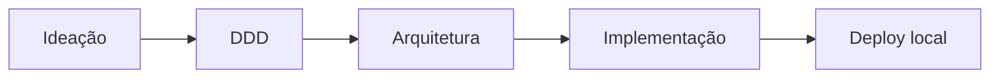

# Hub da documentação

Este diretório conta a história do Maikeise MotoHub: por que o produto existe, quais regras foram descobertas e como elas orientarão a implementação.

> [!TIP]
> Você não precisa ler tudo de uma vez. Escolha uma trilha abaixo e abra os documentos detalhados apenas quando quiser aprofundar uma decisão.

## Trilhas de leitura

### Leitura rápida — visão do projeto

Indicada para recrutadores, apresentação de portfólio ou primeira avaliação.

1. [README principal](../README.md).
2. [Visão do produto](01-product-vision.md).
3. [DDD em uma visão](ddd/00-overview.md).
4. [Arquitetura em uma visão](architecture/00-overview.md).

Tempo estimado: **12 a 15 minutos**.

### Leitura acadêmica — problema e modelagem

Indicada para entender o processo de descoberta e justificar as decisões.

1. [Origem e propósito](00-project-context.md).
2. [Uso responsável de IA](08-ai-assisted-development.md).
3. [Visão do produto](01-product-vision.md).
4. [Escopo e atores](02-scope-and-actors.md).
5. [Jornada principal](03-user-journey.md).
6. [Regras de negócio](04-business-rules.md).
7. [DDD em uma visão](ddd/00-overview.md).
8. [Arquitetura em uma visão](architecture/00-overview.md).
9. [ADR-001](architecture/decisions/ADR-001-monolito-modular-arquitetura-hexagonal.md).
10. [Decisões em aberto e concluídas](07-open-decisions.md).

Tempo estimado: **20 a 30 minutos**.

### Leitura técnica — decisões completas

Indicada para implementação, revisão de arquitetura ou estudo aprofundado.

1. [Linguagem ubíqua](glossary.md).
2. [Subdomínios](ddd/01-subdomains.md).
3. [Bounded Contexts](ddd/02-bounded-contexts.md).
4. [Context Map](ddd/03-context-map.md).
5. [Eventos de domínio](ddd/04-domain-events.md).
6. [Agregados e invariantes](ddd/05-aggregates-and-invariants.md).
7. [Arquitetura](architecture/README.md) e [ADR-001](architecture/decisions/ADR-001-monolito-modular-arquitetura-hexagonal.md).
8. [Requisitos](05-requirements.md) e [backlog](06-backlog.md).

Tempo estimado: **45 minutos ou mais**, conforme o aprofundamento.

## Mapa dos documentos

| Documento | Responde principalmente a... | Perfil |
| --- | --- | --- |
| [Origem e propósito](00-project-context.md) | Qual é a relação com o trabalho da faculdade? | Todos |
| [Uso responsável de IA](08-ai-assisted-development.md) | Como a IA apoia o estudo e como seus resultados são verificados? | Todos |
| [Visão do produto](01-product-vision.md) | Qual problema será resolvido e para quem? | Todos |
| [Escopo e atores](02-scope-and-actors.md) | O que entra no MVP e quem pode fazer o quê? | Produto |
| [Jornada principal](03-user-journey.md) | Como uma consulta se transforma em venda? | Produto |
| [Regras de negócio](04-business-rules.md) | Quais condições nunca podem ser ignoradas? | Produto e desenvolvimento |
| [Requisitos](05-requirements.md) | O que o sistema deverá fazer e com quais qualidades? | Desenvolvimento |
| [Backlog](06-backlog.md) | Em que ordem o trabalho será executado? | Gestão do projeto |
| [Decisões](07-open-decisions.md) | O que já foi decidido e o que ainda precisa de resposta? | Todos |
| [Glossário](glossary.md) | O que cada termo significa neste domínio? | Consulta |
| [DDD em uma visão](ddd/00-overview.md) | Como todo o modelo se conecta? | Todos |
| [Documentos detalhados de DDD](ddd/README.md) | Como cada decisão foi modelada tecnicamente? | Desenvolvimento e estudo |
| [Arquitetura](architecture/README.md) | Como o modelo será implementado e protegido? | Desenvolvimento e estudo |
| [ADR-001](architecture/decisions/ADR-001-monolito-modular-arquitetura-hexagonal.md) | Por que foi escolhido um monólito modular? | Avaliação técnica |
| [Configuração do GitHub Projects](project-management/github-projects-setup.md) | Como o trabalho está organizado em cards? | Gestão do projeto |

## Como a documentação foi escrita

- O resumo aparece antes do detalhe.
- Decisões importantes trazem o motivo, não apenas o resultado.
- Tabelas são usadas para consulta; o texto explica o raciocínio.
- Diagramas mostram relações que seriam difíceis de visualizar somente em listas.
- Seções recolhíveis preservam o aprofundamento sem tornar a primeira leitura cansativa.
- Pontos ainda não decididos permanecem explícitos; não são escondidos como se fossem requisitos.

> [!NOTE]
> A documentação é viva. O código, os testes e o aprendizado durante a implementação poderão revelar ajustes no modelo, que serão registrados em novos commits e ADRs.

## Estado atual

- `Ideação`: concluída para o MVP.
- `DDD`: modelo inicial concluído.
- `Arquitetura`: decisão inicial concluída.
- `Implementação`: próxima etapa, começando pela fundação Spring Boot.
- `Deploy local`: planejado.
