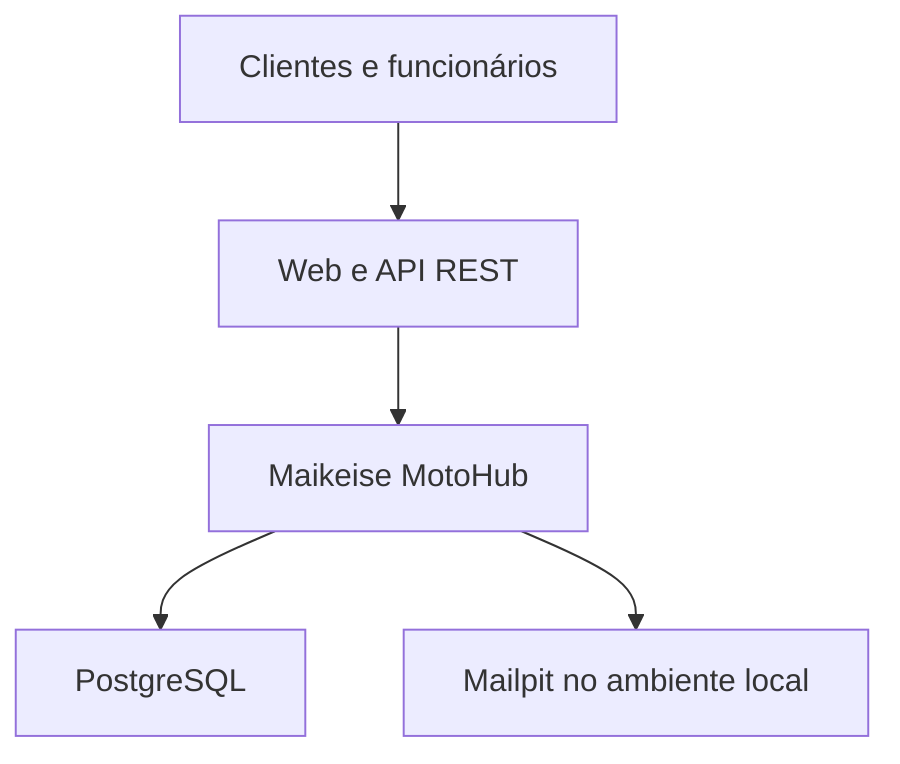
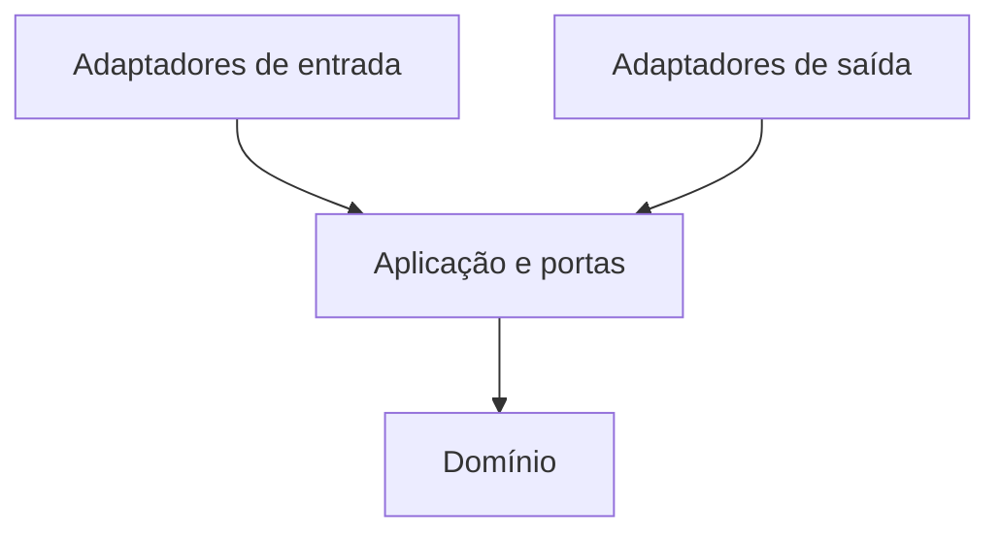
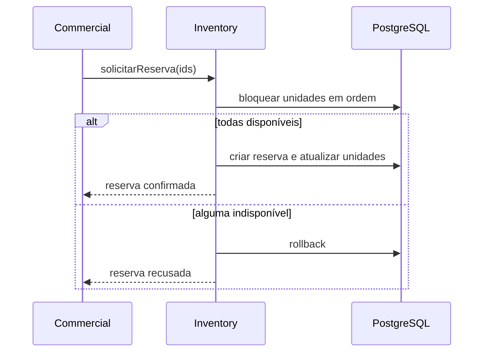
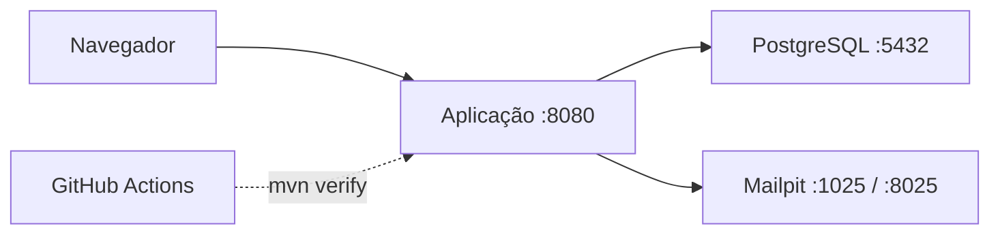

# Arquitetura em uma visão

| Campo | Valor |
| --- | --- |
| Atividade | `BKL-007` |
| Situação | Aceita para planejamento; não implementada |
| Data | 23 de setembro de 2026 |
| Escopo | Arquitetura inicial do MVP |
| Restrição principal | Execução local reproduzível e sem custo obrigatório |

> [!IMPORTANT]
> Esta é uma arquitetura proposta, não uma descrição de software já construído. Se o projeto for retomado, a aplicação deverá começar como uma unidade Spring Boot dividida em módulos de negócio, desde que a revisão técnica confirme esta direção.

> [!NOTE]
> O projeto foi pausado antes da fundação Spring Boot. Estrutura, dependências, transações, testes e execução local ainda não foram comprovados em código.

## Resumo executivo

| Decisão | Escolha |
| --- | --- |
| Estilo de implantação | Monólito modular |
| Organização interna | Um módulo lógico por Bounded Context |
| Arquitetura de cada módulo | Arquitetura Hexagonal |
| Verificação dos limites | Spring Modulith e regras arquiteturais automatizadas |
| Persistência | PostgreSQL único, com schemas separados por contexto |
| Integração imediata | APIs Java públicas dos módulos |
| Integração desacoplada | Eventos persistidos pelo Event Publication Registry |
| Concorrência crítica | Transação local e lock pessimista ordenado nas unidades |
| Interface | REST + Thymeleaf/HTMX |
| Segurança | Spring Security, sessão e permissões explícitas |
| Entrega | Docker Compose local e GitHub Actions |

Essa combinação reduz o custo operacional do início sem transformar o sistema em um monólito sem limites. Os contextos continuam preparados para uma futura extração, mas microsserviços não são tratados como objetivo por si só.

## Padrões escolhidos

| Padrão | Aplicação no MotoHub |
| --- | --- |
| Ports and Adapters | Casos de uso e domínio não dependem de HTTP, JPA ou e-mail. |
| Repository | O domínio declara portas para carregar e persistir Aggregate Roots. |
| Data Mapper | Adaptadores convertem objetos de domínio e entidades JPA. |
| Anti-Corruption Layer | O contexto consumidor traduz contratos sem importar o modelo do fornecedor. |
| Domain Event e Integration Event | Fatos internos são separados dos contratos publicados para outros módulos. |
| Transactional Outbox | O Event Publication Registry persiste a publicação junto com a transação de origem. |
| Idempotent Consumer | Reprocessar um evento ou comando produz o mesmo resultado sem duplicidade. |
| DTO | APIs REST e APIs de módulo expõem dados estáveis sem revelar objetos internos. |

Padrões adicionais só serão adotados quando resolverem um problema concreto. O projeto não criará Factories, Strategies ou abstrações genéricas apenas para aumentar a quantidade de patterns citados.

## Atributos de qualidade

As decisões priorizam:

- **Integridade:** uma unidade não pode participar de duas reservas ativas.
- **Rastreabilidade:** decisões comerciais e ações sensíveis mantêm histórico.
- **Modificabilidade:** um contexto pode evoluir sem acessar o interior dos demais.
- **Testabilidade:** o domínio funciona sem web, banco ou Spring.
- **Segurança:** autenticação, autorização e dados pessoais recebem proteção desde o início.
- **Reprodutibilidade:** outra pessoa consegue executar o projeto com instruções públicas.
- **Custo zero:** nenhuma dependência essencial exige pagamento ou cartão.

## Visão do sistema



O navegador, a API, o banco e o servidor de e-mail local são partes distintas da execução, mas apenas o Maikeise MotoHub contém regras de negócio.

## Módulos de negócio

| Módulo | Bounded Context | Responsabilidade |
| --- | --- | --- |
| `identity` | Identity and Access | Contas, credenciais, sessões, papéis e permissões. |
| `customer` | Customer Management | Clientes PF/PJ e vínculos de representantes. |
| `catalog` | Catalog | Modelos, anúncios, fotos, preço e visão pública. |
| `inventory` | Inventory and Reservation | Unidades físicas, situação, reservas e exclusividade. |
| `commercial` | Commercial | Solicitações, propostas, pagamentos confirmados e vendas. |
| `audit` | Audit | Evidências imutáveis de ações relevantes. |

Os nomes estruturais dos módulos permanecem em inglês porque correspondem aos nomes oficiais dos Bounded Contexts. Os conceitos do negócio continuam usando a linguagem ubíqua em português, como `Cliente`, `Proposta`, `Reserva` e `Venda`.

<details>
<summary><strong>Estrutura de pacotes e Arquitetura Hexagonal</strong></summary>

## Estrutura do projeto

O repositório começa com um único projeto Maven:

```text
src/main/java/com/maikeise/motohub
├── MaikeiseMotoHubApplication.java
├── identity
├── customer
├── catalog
├── inventory
├── commercial
└── audit
```

Cada contexto é um módulo lógico do Spring Modulith. Um módulo não equivale a um `pom.xml`, processo ou container independente.

### Interior de um módulo

```text
commercial
├── package-info.java
├── api
│   ├── package-info.java
│   ├── CommercialOperations.java
│   └── event
└── internal
    ├── domain
    │   ├── model
    │   ├── event
    │   └── service
    ├── application
    │   ├── port
    │   │   ├── in
    │   │   └── out
    │   └── usecase
    └── adapter
        ├── in
        │   ├── rest
        │   └── web
        └── out
            ├── persistence
            └── event
```

- `api` contém somente contratos autorizados para outros módulos.
- `domain` contém agregados, entidades, Value Objects, eventos e regras puras.
- `application` coordena casos de uso e declara portas.
- `adapter/in` recebe HTTP, ações da interface ou tarefas agendadas.
- `adapter/out` implementa persistência, eventos e outras integrações.



O diagrama representa dependências de código. Em tempo de execução, a aplicação chama uma porta de saída cuja implementação é fornecida por um adaptador.

### Regras verificáveis

1. O domínio não importa Spring, JPA, HTTP ou classes de adaptadores.
2. Outros módulos acessam somente interfaces nomeadas em `api`.
3. Pacotes `internal` nunca são importados por outro contexto.
4. Dependências entre módulos não formam ciclos.
5. Controllers não contêm regra de negócio.
6. Entidades JPA não atravessam a porta de persistência.
7. Não existe pacote genérico de entidades `shared` ou `common`.
8. Compartilhamento técnico somente nasce depois de uma necessidade comprovada.

Um teste com `ApplicationModules.verify()` protegerá os limites do Spring Modulith. Regras adicionais de Arquitetura Hexagonal serão verificadas com jMolecules/ArchUnit quando a estrutura existir.

</details>

<details>
<summary><strong>Persistência, schemas e transações</strong></summary>

## Persistência

Haverá uma instância PostgreSQL e um database chamado `maikeise_motohub`.

```text
maikeise_motohub
├── identity_access
├── customer_management
├── catalog
├── inventory_reservation
├── commercial
├── audit
└── infrastructure
```

Os seis primeiros schemas pertencem aos Bounded Contexts. `infrastructure` guarda metadados técnicos, como o histórico de migrations e o registro de publicações de eventos.

### Regras de propriedade

- Cada módulo cria e altera somente as próprias tabelas.
- Não existem associações JPA ou chaves estrangeiras entre contextos.
- IDs tipados representam referências externas ao módulo.
- Joins entre schemas não são contratos de integração.
- Consultas combinadas usam APIs internas, eventos ou modelos de leitura dedicados.
- Restrições e chaves estrangeiras continuam normais dentro do mesmo schema.

### Domínio e JPA

Objetos de domínio não recebem `@Entity`. O adaptador de saída mantém entidades de persistência e as converte com um Data Mapper:

```text
Proposta              -> modelo do domínio
PropostaRepository    -> porta de saída
PropostaJpaEntity     -> representação persistida
PropostaMapper        -> conversão
PropostaPersistenceAdapter -> implementação da porta
```

Somente Aggregate Roots possuem portas de repositório. Interfaces do Spring Data ficam dentro do adaptador e não são expostas ao domínio.

### Migrations

Flyway Open Source será a única autoridade para criar e evoluir a estrutura. Hibernate usará `ddl-auto=validate`; migrations aplicadas não serão editadas retroativamente.

### Fronteiras transacionais

- A transação começa no caso de uso, não no controller.
- Uma mudança de Aggregate Root ocorre no contexto proprietário.
- A criação de uma reserva atualiza a `Reserva` e todas as `UnidadeEstoque` em uma transação local.
- Um orquestrador que chama mais de um módulo não mantém uma transação aberta ao redor do processo inteiro.
- Cada comando publicado pela API de um módulo controla sua própria transação; propagação será configurada explicitamente quando necessário.
- Processos entre contextos não dependem de rollback global.
- Falhas parciais são tratadas com idempotência, repetição segura e estado explícito.

</details>

<details>
<summary><strong>Comunicação e entrega confiável de eventos</strong></summary>

## Comunicação entre módulos

| Necessidade | Mecanismo |
| --- | --- |
| Resposta necessária para continuar | Chamada Java pela API pública do módulo |
| Reação secundária | Evento de integração assíncrono |
| Expiração ou nova tentativa | Tarefa agendada configurável |
| Integração externa futura | Adaptador substituível sem mudar o domínio |

Não haverá HTTP entre módulos do monólito.

### Eventos

Eventos de domínio permanecem internos. Quando outro contexto precisa reagir, a camada de aplicação publica um evento de integração pequeno e imutável:

```text
ReservaConfirmadaEvent
├── eventId
├── occurredAt
├── correlationId
├── schemaVersion
├── reservaId
└── unidadeIds
```

O evento não transporta entidades JPA, senhas, tokens ou objetos completos de outro contexto.

### Confiabilidade

O Event Publication Registry do Spring Modulith registra uma publicação na mesma transação da mudança de origem. Cada consumidor é marcado como concluído somente depois de processar o evento. Falhas permanecem visíveis e podem ser republicadas.

Esse registro exerce o papel de uma outbox transacional dentro do monólito. Consumidores ainda precisam ser idempotentes, porque uma falha depois do efeito e antes da confirmação pode provocar nova entrega.

### Tempo

Expirações e novas tentativas usam `@Scheduled`, configurações externas e um `Clock` injetável. No MVP haverá uma instância da aplicação; coordenação distribuída de schedulers somente será adicionada se surgir execução com múltiplas instâncias.

</details>

## Fluxos críticos

### Reserva concorrente



`Inventory and Reservation` ordena os IDs, carrega as unidades com `PESSIMISTIC_WRITE`, verifica todas e persiste a reserva na mesma transação. Uma falha rejeita o conjunto inteiro. Campos de versão e restrições no banco fornecem proteção adicional.

### Conta e cadastro do cliente

Conta e cliente não são criados em uma falsa transação entre contextos:

1. `Identity and Access` cria a conta pendente e confirma o e-mail em sua própria transação.
2. A pessoa autenticada completa o perfil em `Customer Management`.
3. A criação do perfil usa `accountId` como chave idempotente e não duplica o cliente em uma repetição.
4. Uma conta confirmada sem perfil pode acessar apenas o fluxo de conclusão cadastral.
5. Operações comerciais exigem conta autorizada e cliente comercialmente habilitado.

Assim, uma falha no cadastro não desfaz uma conta válida nem libera acesso comercial incompleto.

### Conclusão da venda

1. `Commercial` valida proposta, snapshot, pagamento e permissão; essa leitura termina antes da ação irreversível.
2. O orquestrador solicita de forma síncrona a utilização da reserva com um `operationId` idempotente, sem envolver os dois módulos em uma única transação.
3. `Inventory and Reservation` marca reserva e unidades em sua transação local e publica `ReservaUtilizadaNaVenda` de forma confiável.
4. `Commercial` cria a `Venda` definitiva e converte a proposta em outra transação local, protegendo a unicidade por `reservaId`.
5. Se essa gravação falhar depois da utilização, o evento persistido provoca nova tentativa.
6. Uma repetição encontra a venda existente e devolve o mesmo resultado.

Não existe transação distribuída. Uma falha persistente fica com correlação visível para recuperação; ela não libera automaticamente unidades que já foram marcadas como vendidas.

Tanto a resposta síncrona quanto o consumidor do evento chamam o mesmo caso de uso idempotente de finalização. Se as duas execuções coincidirem, a restrição única por `reservaId` define um único resultado vencedor; a outra execução recupera e devolve a venda já existente.

<details>
<summary><strong>API, interface e segurança</strong></summary>

## Adaptadores de entrada

- REST versionada em `/api/v1` para integração, testes e portfólio.
- Thymeleaf para HTML renderizado no servidor.
- HTMX para atualizar partes da página sem uma SPA separada.
- Controllers REST e web usam as mesmas portas de entrada, sem chamar um ao outro por HTTP.

DTOs de entrada e saída protegem o domínio. Validação usa Jakarta Validation, e erros HTTP seguem Problem Details. O contrato REST será publicado com OpenAPI.

## Segurança

- Spring Security com login por e-mail e senha protegida.
- Sessão HTTP e cookie `HttpOnly`, `SameSite` e `Secure` quando houver HTTPS.
- CSRF habilitado para operações mutáveis.
- Permissões explícitas agrupadas em papéis.
- Autorização no endpoint e no caso de uso sensível.
- Identidade do cliente derivada da sessão, nunca confiada apenas a um ID recebido.
- Segredos e dados pessoais não aparecem nos logs.

JWT não entra no MVP porque frontend e backend compartilham origem e implantação. OAuth2/OIDC ou tokens poderão ser adicionados quando houver cliente externo ou serviços independentes.

</details>

<details>
<summary><strong>Stack, testes, observabilidade e execução</strong></summary>

## Baseline tecnológico

| Área | Escolha inicial |
| --- | --- |
| Runtime | Eclipse Temurin Java 21 LTS |
| Aplicação | Spring Boot 4.1.1 |
| Módulos | Spring Modulith 2.1.1 |
| Build | Apache Maven 3.9.x executado pelo Maven Wrapper |
| Banco | PostgreSQL 18 |
| Migrations | Flyway Open Source |
| Persistência | Spring Data JPA/Hibernate |
| Interface | Thymeleaf e HTMX |
| API | Spring MVC e springdoc-openapi |
| Testes | JUnit, Mockito, Spring Modulith Test e Testcontainers |
| Qualidade | Spotless, SpotBugs, JaCoCo e Maven Enforcer |
| Execução | Docker Compose |
| E-mail local | Mailpit |
| CI | GitHub Actions em repositório público |

Versões transitivas serão administradas pelos BOMs do Spring Boot e Spring Modulith. Atualizações de patch passam pelo pipeline antes de entrar na `main`.

## Estratégia de testes

| Nível | Principal objetivo |
| --- | --- |
| Domínio puro | Invariantes, Value Objects e transições de estado |
| Aplicação | Coordenação, permissões, portas e falhas |
| Arquitetura | Limites, ciclos e direção de dependências |
| Módulo | Integração isolada de um contexto |
| Persistência | JPA, Flyway, restrições e locks com PostgreSQL real |
| Web e segurança | Contratos, validação, autenticação, CSRF e autorização |

Testcontainers substitui bancos em memória nos testes de integração. Cobertura é uma medida auxiliar; a regra principal é testar cada invariante e fluxo de risco.

## Observabilidade

Spring Boot Actuator e Micrometer fornecem healthchecks e métricas. Logs incluem correlação, módulo e caso de uso, sem informações sensíveis. Auditoria de negócio continua separada de logs técnicos.

## Execução local



`docker compose up --build` inicia aplicação, banco e servidor de e-mail local. O repositório inclui Dockerfile em múltiplos estágios, healthchecks, `.env.example` e instruções de execução. Nenhum segredo real é versionado.

</details>

## Critérios para considerar a arquitetura implementada

- `ApplicationModules.verify()` passa no build.
- Nenhum módulo importa o pacote `internal` de outro.
- Cada schema é criado por migrations reproduzíveis.
- O domínio compila e é testado sem adaptadores.
- Reserva concorrente é coberta com PostgreSQL real.
- Eventos com falha permanecem recuperáveis.
- Permissões são verificadas no servidor.
- `./mvnw verify` passa localmente e no GitHub Actions.
- `docker compose up --build` inicia todo o ambiente sem serviço pago.

## Quando reconsiderar microsserviços

A decisão será revisada somente quando existir evidência de pelo menos um destes fatores:

- necessidade de implantação independente;
- escala muito diferente entre capacidades;
- isolamento de falhas com valor operacional;
- equipes autônomas com cadências distintas;
- requisito de disponibilidade específico por contexto;
- custo de mudança dentro do monólito maior que o custo da distribuição.

Antes de qualquer extração, o módulo precisa possuir contrato estável, dados próprios, testes, observabilidade e plano de migração. A primeira candidata provável seria uma capacidade com baixo acoplamento, não necessariamente o Core mais complexo.

## Custo obrigatório

| Item | Custo para estudo |
| --- | ---: |
| Java, Spring, Maven e bibliotecas | R$ 0 |
| PostgreSQL, Flyway OSS e Mailpit | R$ 0 |
| Docker Desktop para uso educacional/pessoal | R$ 0 |
| GitHub Actions com runner padrão em repositório público | R$ 0 |
| Nuvem, broker e APM pago | Não utilizados |

## O que registrar no caderno

- Monólito modular descreve a implantação; Arquitetura Hexagonal descreve dependências internas.
- Bounded Context não é sinônimo de microsserviço.
- Dependências apontam para o domínio; adaptadores implementam portas.
- Um banco físico pode conter schemas com proprietários lógicos diferentes.
- Processo entre contextos usa idempotência e repetição segura, não uma transação distribuída.
- Evento confiável precisa ser persistido; consumidor confiável também precisa ser idempotente.
- Log técnico, métrica e auditoria resolvem problemas diferentes.

## Referências técnicas

- [Spring Modulith](https://docs.spring.io/spring-modulith/reference/)
- [Spring Boot](https://docs.spring.io/spring-boot/)
- [Spring Security](https://docs.spring.io/spring-security/reference/)
- [Spring Data JPA](https://docs.spring.io/spring-data/jpa/reference/)
- [PostgreSQL](https://www.postgresql.org/docs/)
- [Flyway Open Source](https://documentation.red-gate.com/flyway/reference/usage/flyway-open-source)
- [Testcontainers for Java](https://java.testcontainers.org/)
- [Thymeleaf](https://www.thymeleaf.org/documentation.html)
- [HTMX](https://htmx.org/docs/)
- [Maven Wrapper](https://maven.apache.org/tools/wrapper/)

[Consultar a decisão formal no ADR-001](decisions/ADR-001-monolito-modular-arquitetura-hexagonal.md).

[Voltar ao Hub da arquitetura](README.md).
