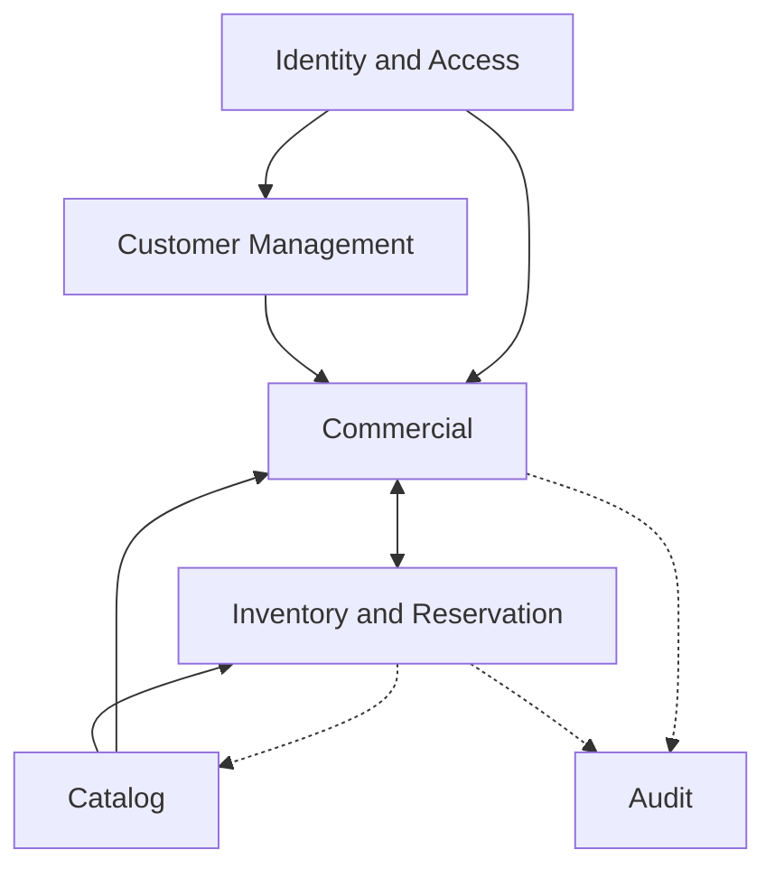
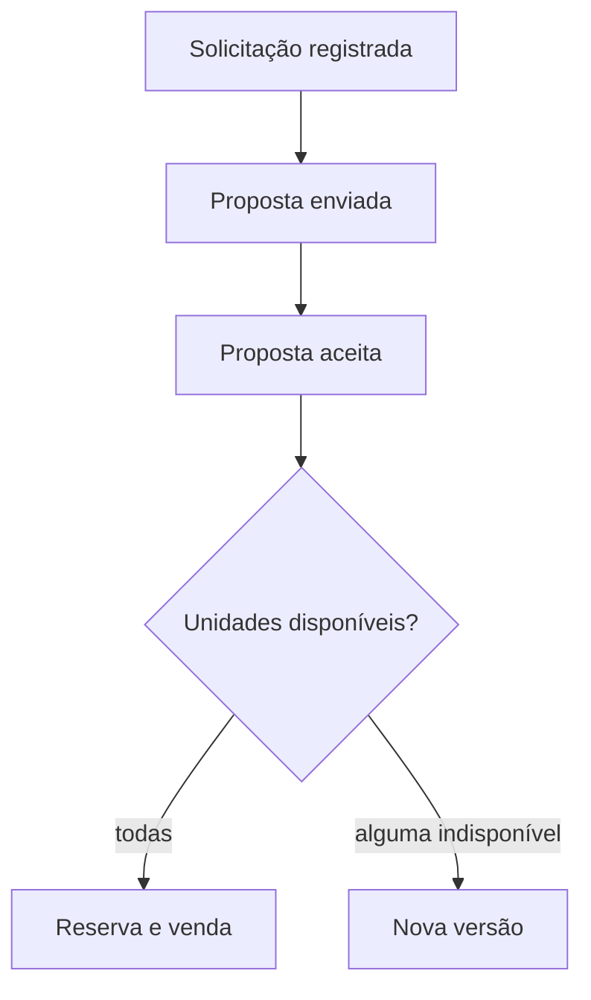

# DDD em uma visão

Este é o ponto de entrada para a modelagem do Maikeise MotoHub. Ele resume as decisões estratégicas e táticas sem substituir os documentos detalhados usados no estudo.

> [!IMPORTANT]
> O coração do domínio é transformar unidades disponíveis em vendas controladas, por meio de proposta, aceite, reserva e conclusão, sem permitir que a mesma motocicleta seja prometida a clientes diferentes.

## A história do negócio

Uma pessoa pode consultar o catálogo sem entrar no sistema. Para negociar, precisa de uma conta confirmada e de um cadastro comercial válido. O cliente escolhe unidades físicas específicas, solicita uma proposta e recebe uma versão preparada pelo vendedor.

A proposta vale sete dias. Descontos acima de 10% precisam da aprovação de um gerente para aquela versão exata. Quando o cliente aceita, o sistema tenta reservar todas as unidades juntas. Se qualquer uma estiver indisponível, nenhuma é bloqueada. Com a reserva ativa e o pagamento externo confirmado, a venda pode ser concluída.

Esse fluxo parece simples na interface, mas concentra as principais decisões de consistência, concorrência e histórico do projeto.

## Os seis Bounded Contexts

| Contexto | Responsabilidade | Classificação relacionada |
| --- | --- | --- |
| `Identity and Access` | Contas, autenticação, convites, papéis e permissões. | Generic |
| `Customer Management` | Clientes PF, clientes PJ e vínculos de representantes. | Supporting |
| `Catalog` | Modelos, anúncios, fotos, preço e disponibilidade pública. | Supporting |
| `Inventory and Reservation` | Unidades físicas, situação operacional, exclusividade e prazo da reserva. | Core |
| `Commercial` | Solicitações, versões de proposta, desconto, aceite, pagamento confirmado e venda. | Core |
| `Audit` | Evidências seguras de ações e decisões importantes. | Supporting |



Setas contínuas representam decisões que precisam de resposta imediata. Setas tracejadas representam atualizações que aceitam consistência eventual.

## Fluxo comercial essencial



O aceite e a reserva são fatos diferentes. O aceite apenas dispara a tentativa; `Inventory and Reservation` continua sendo a autoridade sobre a disponibilidade real.

## Regras que mais influenciaram o desenho

| Tema | Regra | Efeito no modelo |
| --- | --- | --- |
| Unidade física | Cada motocicleta é identificada e escolhida individualmente. | `ModeloMotocicleta` e `UnidadeEstoque` são conceitos diferentes. |
| Proposta | Versões enviadas são preservadas e não sofrem edição retroativa. | `VersaoProposta` pertence ao agregado `Proposta`. |
| Desconto | Acima de 10%, a versão exata precisa de aprovação. | Aprovação não pode ser reaproveitada depois de uma mudança. |
| Reserva | Todas as unidades são reservadas ou nenhuma delas é. | Criação usa uma transação local e proteção contra concorrência. |
| Exclusividade | Uma unidade não participa de duas reservas ativas. | Estoque e reservas permanecem no mesmo contexto. |
| Prazo | Reserva inicial de 48 horas, prorrogável uma única vez por 24 horas. | O agregado controla vencimento e uso da prorrogação. |
| Venda | Exige proposta aceita, reserva ativa e pagamento confirmado. | `Venda` nasce definitiva e guarda um snapshot imutável. |
| Cancelamento | Uma venda não é apagada; ela é compensada. | A venda fica no histórico e as unidades seguem para revisão. |

## Modelo tático em números

Foram identificadas **11 Aggregate Roots**:

| Contexto | Aggregate Roots |
| --- | --- |
| Identity and Access | `ContaAcesso`, `ConviteFuncionario` |
| Customer Management | `Cliente` |
| Catalog | `ModeloMotocicleta`, `Anuncio` |
| Inventory and Reservation | `UnidadeEstoque`, `Reserva` |
| Commercial | `SolicitacaoProposta`, `Proposta`, `Venda` |
| Audit | `RegistroAuditoria` |

As raízes são pequenas o suficiente para evitar carregamentos e bloqueios desnecessários, mas mantêm juntas as regras que precisam de consistência imediata.

### Princípios aplicados

- Aggregate Roots são a única porta de alteração de seus objetos internos.
- Outros agregados são referenciados por IDs tipados.
- Entidades internas e Value Objects não possuem repositórios próprios.
- Regras globais de unicidade usam consulta para erro amigável e restrição no banco para concorrência.
- Serviços de aplicação coordenam casos de uso; não substituem o comportamento do domínio.
- Nenhuma associação JPA atravessará um Bounded Context.

## Decisões e trade-offs

### Por que não começar com microsserviços?

Os limites de negócio foram identificados primeiro, mas a implantação distribuída ainda não entrega benefício demonstrável ao MVP. A direção inicial é um monólito modular: mais simples para desenvolver e operar, mantendo os módulos preparados para uma eventual extração.

### Por que Catalog não controla a reserva?

O catálogo é uma representação voltada à leitura e pode ficar brevemente desatualizado. A tentativa de reserva sempre consulta o estoque operacional, que possui a regra definitiva.

### Por que UnidadeEstoque e Reserva são raízes separadas?

Um agregado único de estoque cresceria continuamente e criaria contenção entre operações independentes. As raízes ficam separadas, enquanto o caso de uso de reserva coordena as unidades em uma única transação local.

### Por que preservar snapshots?

Preço, descrição e dados do cliente podem mudar. Uma proposta ou venda histórica precisa continuar mostrando exatamente as condições utilizadas naquele momento.

> [!NOTE]
> Eventos de domínio são usados para registrar acontecimentos e provocar reações. O projeto não decidiu usar Event Sourcing.

## Direção arquitetural

A `BKL-007` formalizou a seguinte direção:

```text
Monólito modular
└── um módulo por Bounded Context
    └── Arquitetura Hexagonal
        ├── domínio
        ├── aplicação e portas
        └── adaptadores de entrada e saída
```

Cada módulo controlará seu modelo e suas tabelas lógicas. Integrações usarão contratos explícitos, IDs, snapshots e eventos; não haverá compartilhamento de entidades ou repositórios.

A estrutura, as transações, a segurança e a estratégia de testes estão detalhadas em [Arquitetura em uma visão](../architecture/00-overview.md) e registradas formalmente na [ADR-001](../architecture/decisions/ADR-001-monolito-modular-arquitetura-hexagonal.md).

## O que ainda está aberto

- Limite máximo de desconto que nem o gerente pode aprovar.
- Existência de uma ou mais filiais na primeira concessionária.
- Matriz exata para gerenciar representantes de clientes PJ.
- Licença do repositório.

Manter essas perguntas visíveis evita transformar suposições em requisitos.

## Onde aprofundar

<details>
<summary><strong>Abrir a sequência completa da modelagem</strong></summary>

1. [Subdomínios](01-subdomains.md): identifica Core, Supporting e Generic.
2. [Bounded Contexts](02-bounded-contexts.md): define limites, responsabilidades e propriedade dos dados.
3. [Context Map](03-context-map.md): explica dependências e formas de integração.
4. [Eventos de domínio](04-domain-events.md): acompanha comandos, fatos e políticas do fluxo.
5. [Agregados e invariantes](05-aggregates-and-invariants.md): detalha o modelo tático e as fronteiras de consistência.
6. [Arquitetura](../architecture/00-overview.md): transforma os limites em módulos, persistência, integrações e testes.

</details>

[Voltar ao Hub da documentação](../README.md).
