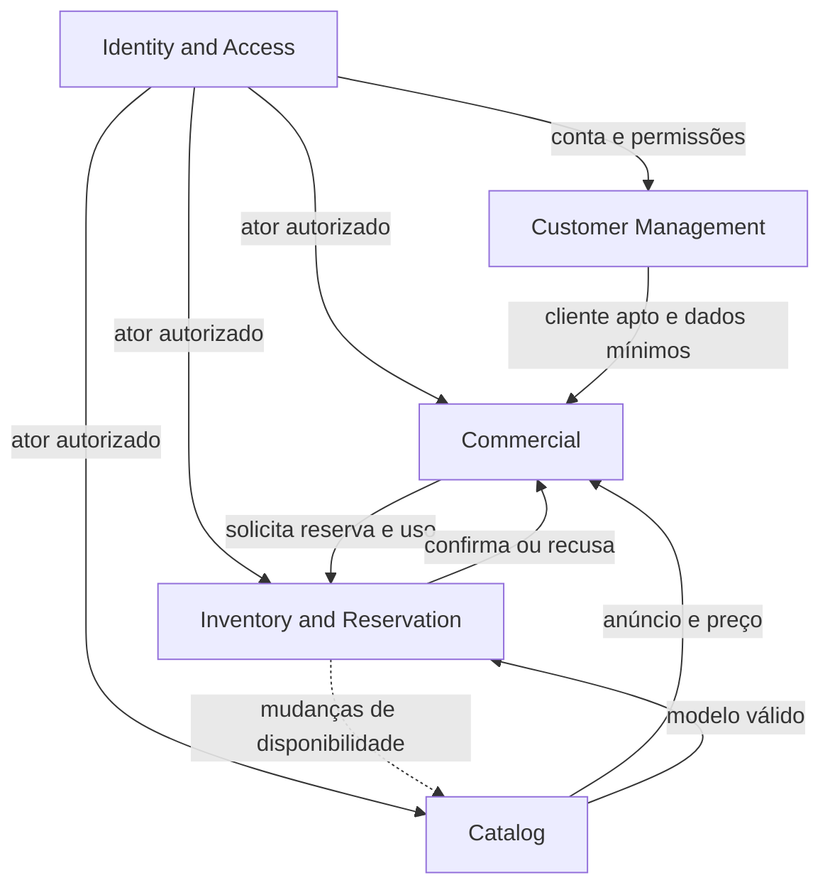
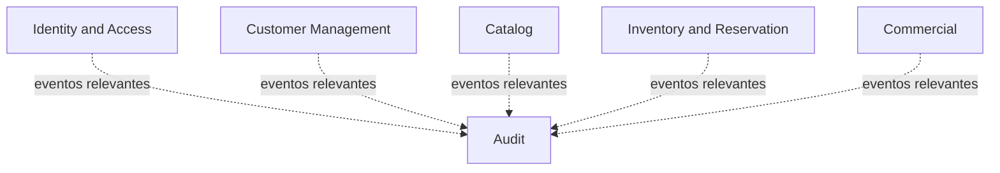

# Context Map do Maikeise MotoHub

Este documento registra as relações iniciais entre os Bounded Contexts do Maikeise MotoHub, consolidadas na `BKL-004`. Os eventos foram refinados na `BKL-005`, e os mecanismos técnicos de integração foram formalizados na [arquitetura inicial](../architecture/00-overview.md).

> [!TIP]
> Para uma leitura rápida, observe os dois diagramas e a matriz de relacionamentos. A explicação de cada padrão está disponível na seção recolhível.

## Objetivo

O Context Map torna explícito:

- quem fornece e quem consome cada informação;
- quais modelos precisam ser protegidos por tradução;
- quais relações exigem coordenação próxima;
- quais respostas precisam ser imediatas;
- quais atualizações podem alcançar consistência eventual;
- quais dependências não devem existir.

O mapa descreve relações de domínio. Ele ainda não determina se uma integração será implementada por chamada Java, HTTP ou mensageria.

## Conceitos utilizados

| Conceito | Significado neste mapa |
| --- | --- |
| Upstream | Contexto que fornece uma informação, capacidade ou contrato. |
| Downstream | Contexto que consome aquilo que foi fornecido. |
| Partnership | Dois contextos coordenam um fluxo do qual ambos dependem. |
| Customer/Supplier | O contexto consumidor apresenta suas necessidades e o fornecedor oferece um contrato apropriado. `Customer`, neste nome de padrão, significa consumidor e não o cliente da concessionária. |
| Open Host Service | Serviço com contrato estável disponibilizado a vários consumidores. |
| Published Language | Formato de comunicação explicitamente definido e compreendido pelos contextos envolvidos. |
| Anti-Corruption Layer | Camada de tradução que protege o modelo do contexto consumidor. |
| Síncrono | O fluxo precisa aguardar uma resposta para continuar. |
| Assíncrono | O publicador não aguarda o processamento de todos os consumidores. |
| Consistência eventual | Uma representação pode ficar temporariamente desatualizada, mas converge para o estado correto. |

Upstream e downstream descrevem a direção da dependência sobre um contrato. Essa direção não é necessariamente igual à direção de todas as chamadas ou eventos executados em tempo de execução.

## Visão operacional

As setas contínuas representam necessidades inicialmente síncronas. A seta tracejada representa uma atualização assíncrona.

## Fluxo de auditoria

`Audit` recebe representações dos acontecimentos. Ele não se torna a fonte oficial do estado dos demais contextos.

## Matriz de relacionamentos

| Upstream | Downstream | Informação ou capacidade | Modo inicial | Padrão principal |
| --- | --- | --- | --- | --- |
| Identity and Access | Contextos protegidos | `accountId`, identidade autenticada e permissões | Síncrono ou validado localmente na entrada | Open Host Service + Published Language |
| Customer Management | Commercial | Aptidão comercial e resumo mínimo do cliente | Síncrono | Customer/Supplier |
| Catalog | Commercial | Unidade anunciada, descrição e preço atual | Síncrono | Published Language + ACL em Commercial |
| Catalog | Inventory and Reservation | Existência e situação do modelo referenciado | Síncrono | Open Host Service + Published Language |
| Inventory and Reservation | Catalog | Alterações de disponibilidade da unidade | Assíncrono | Published Language por eventos |
| Commercial | Inventory and Reservation | Solicitação de reserva e confirmação de uso | Síncrono | Partnership |
| Inventory and Reservation | Commercial | Confirmação ou recusa das operações solicitadas | Síncrono | Partnership |
| Contextos operacionais | Audit | Acontecimentos relevantes e ator responsável | Assíncrono | Published Language por eventos |

<strong>Aprofundar os padrões de relacionamento entre contextos</strong>

## Identity and Access como Open Host Service

`Identity and Access` oferece um contrato mínimo e estável para autenticação e autorização. Os consumidores recebem informações como `accountId`, estado da autenticação e permissões necessárias, sem acessar senha, hash, token interno, entidade ou repositório de contas.

O contexto de acesso informa quem está autenticado e o que a conta está autorizada a executar. A regra que determina quando uma autorização é exigida permanece no contexto de negócio. Por exemplo:

- `Identity and Access` informa se a conta pode aprovar desconto especial;
- `Commercial` determina que descontos acima de 10% precisam dessa aprovação.

`Customer Management` associa cliente ou representante por `accountId`. Bloquear a conta não apaga nem inativa automaticamente o cadastro comercial.

## Customer Management como fornecedor de Commercial

`Customer Management` é upstream e `Commercial` é downstream nessa relação. Antes de iniciar uma negociação, `Commercial` consulta um contrato voltado às suas necessidades para confirmar que o cliente existe, está ativo e pode ser representado pela pessoa correta.

`Commercial` não importa a entidade de cliente. Ele preserva `customerId` e somente o snapshot mínimo necessário ao histórico da proposta ou venda. Alterações posteriores no cadastro não reescrevem documentos comerciais anteriores.

O padrão `Customer/Supplier` não utiliza a palavra Customer no sentido de cliente da concessionária. Nesse padrão, ela identifica o contexto consumidor do contrato.

## Catalog protegido por uma ACL em Commercial

Ao criar uma versão de proposta, `Commercial` consulta o anúncio atual no `Catalog`. Uma Anti-Corruption Layer dentro de `Commercial` traduz descrição, preço anunciado e informações da unidade para seu próprio modelo de proposta.

O resultado é preservado como snapshot. Uma alteração posterior no anúncio não modifica uma versão de proposta já criada.

`Catalog` apresenta a unidade e seu preço, mas não toma a decisão definitiva de reservá-la. Essa decisão pertence a `Inventory and Reservation`.

## Catalog e Inventory and Reservation

Existem dois fluxos independentes entre esses contextos:

1. Ao cadastrar uma unidade, `Inventory and Reservation` consulta `Catalog` para validar o `modelId` informado.
2. Quando a situação operacional da unidade muda, `Inventory and Reservation` publica um evento para atualizar a representação mantida pelo `Catalog`.

A validação do modelo precisa de resposta imediata. A atualização da disponibilidade aceita consistência eventual porque o catálogo é uma representação de leitura. Mesmo que ela fique brevemente desatualizada, a tentativa de reserva sempre passa pela validação definitiva de `Inventory and Reservation`.

Os dois contextos evoluem por contratos publicados. Eles não compartilham entidades, repositórios ou associações JPA.

## Partnership entre Commercial e Inventory and Reservation

Esses são os dois contextos Core do fluxo principal e precisam coordenar:

- solicitação e confirmação da reserva;
- recusa por indisponibilidade;
- utilização da reserva para concluir a venda;
- transição da unidade para vendida.

`Commercial` coordena a negociação, mas `Inventory and Reservation` continua sendo a autoridade sobre disponibilidade e exclusividade. As respostas precisam ser síncronas porque o fluxo comercial não pode presumir que a unidade foi bloqueada ou vendida.

A Partnership exige coordenação conceitual, não dependência circular no código. Cada módulo acessará contratos explícitos por portas e adaptadores e manterá sua própria transação.

Não haverá uma transação de banco distribuída entre os contextos. A arquitetura combina APIs síncronas, idempotência, restrições únicas e eventos persistidos para recuperar falhas sem duplicar a venda.

## Audit como downstream assíncrono

Os contextos publicam eventos sobre ações selecionadas. `Audit` consome esses contratos e cria seu próprio `AuditEntry`, contendo apenas dados necessários, como contexto de origem, objeto afetado, `actorAccountId`, data, resultado e justificativa segura.

Entre os eventos auditáveis estão conta bloqueada, cliente bloqueado comercialmente, preço alterado, reserva prorrogada, desconto aprovado, pagamento externo confirmado, venda concluída e venda cancelada. A lista completa está na `BKL-005`.

A indisponibilidade temporária da auditoria não deve transformar seu banco na autoridade sobre a operação original. Eventos obrigatórios serão registrados pelo Event Publication Registry do Spring Modulith na mesma transação da mudança de origem e reenviados aos consumidores que falharem.

## Consistência esperada

| Operação | Necessidade de consistência |
| --- | --- |
| Validar autenticação e autorização | Resposta imediata na entrada da operação |
| Validar cliente antes da negociação | Resposta imediata |
| Obter anúncio e preço para uma nova versão | Resposta imediata e snapshot em Commercial |
| Validar modelo ao cadastrar unidade | Resposta imediata |
| Criar, utilizar ou recusar reserva | Consistência forte dentro de Inventory and Reservation |
| Refletir disponibilidade no catálogo | Consistência eventual |
| Registrar trilha adicional de auditoria | Consistência eventual com entrega confiável |

## Regras de integração

1. Nenhum contexto importa entidades, agregados ou repositórios internos de outro contexto.
2. Não existem associações JPA entre contextos.
3. Um banco PostgreSQL compartilhado fisicamente não permite consultas às tabelas de outro módulo.
4. Referências entre contextos usam identificadores, contratos e snapshots explícitos.
5. Contratos são traduzidos na fronteira quando o modelo consumidor precisa de proteção.
6. Eventos descrevem acontecimentos concluídos e usam nomes no passado.
7. Operações repetíveis entre contextos deverão ser idempotentes.
8. Cada contexto conclui sua própria transação.
9. A Partnership não autoriza ciclos de dependência no código.
10. O projeto não adotará Shared Kernel entre os contextos de negócio.

## Relações que não existirão diretamente

- `Customer Management` não reserva unidades; `Commercial` envia somente a referência necessária para `Inventory and Reservation`.
- `Catalog` não consulta tabelas de estoque nem decide reservas.
- `Audit` não autoriza nem comanda operações nos contextos de origem.
- `Identity and Access` não contém regras de proposta, desconto, reserva ou venda.
- Nenhum contexto utiliza o banco de outro como contrato de integração.

## Encaminhamentos arquiteturais

- Conta e cadastro de cliente são criados em etapas locais, idempotentes e recuperáveis, sem transação distribuída.
- A conclusão da venda utiliza a reserva por API síncrona e registra um evento persistido; `operationId` e restrição única por `reservaId` tornam a repetição segura.
- O Event Publication Registry fornece entrega confiável aos consumidores assíncronos dentro do monólito.
- Spring Security valida a sessão e as permissões na entrada; cada caso de uso ainda protege sua autorização de negócio.
- Processos temporais usam `@Scheduled` e uma abstração de `Clock`, com operações idempotentes.

## Continuidade

Os acontecimentos, comandos, decisões e reações destas relações estão detalhados em [Eventos de domínio e Event Storming textual](04-domain-events.md). As fronteiras internas estão em [Agregados e invariantes](05-aggregates-and-invariants.md), e os mecanismos técnicos estão na [arquitetura inicial](../architecture/00-overview.md).

[Voltar ao resumo do DDD](00-overview.md).
