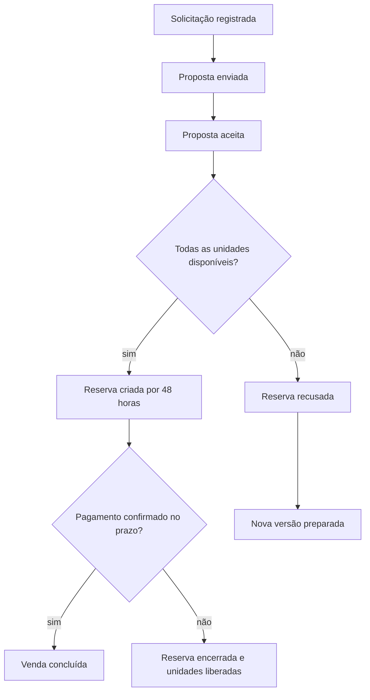
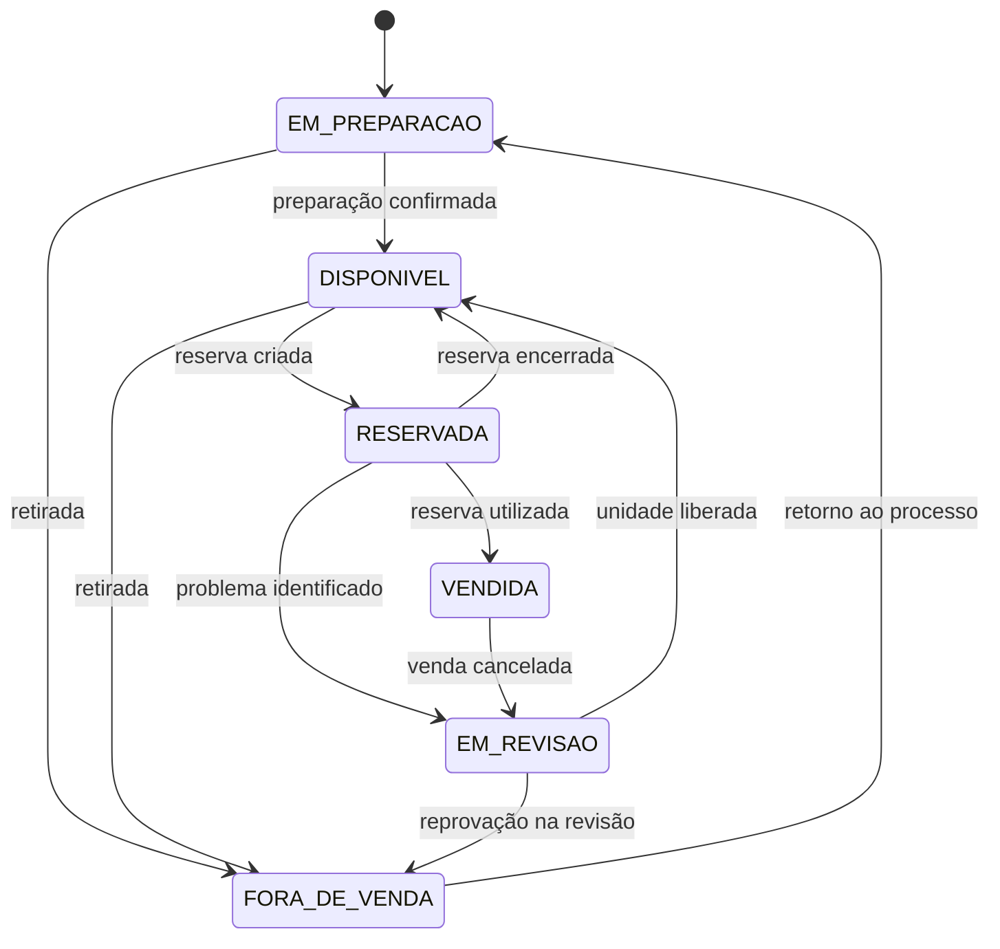

# Eventos de domínio e Event Storming textual

Este documento consolida a `BKL-005` do Maikeise MotoHub. Ele transforma o fluxo comercial e as relações do Context Map em atores, comandos, eventos, políticas e pontos de decisão explícitos.

O resultado é uma fotografia do conhecimento atual. Os nomes servem como linguagem de modelagem e ainda não obrigam que cada evento se torne uma classe Java, uma mensagem externa ou uma tabela própria.

> [!TIP]
> Leia o resumo e a linha do tempo primeiro. Cada etapa do Event Storming está recolhida e pode ser aberta separadamente quando você quiser estudar comandos, eventos e políticas.

## Resumo executivo

- O cliente solicita uma proposta para unidades físicas específicas.
- A proposta enviada vale sete dias e preserva a versão negociada.
- O aceite dispara uma tentativa automática de reserva.
- Todas as unidades são reservadas juntas ou nenhuma delas é.
- A reserva vale 48 horas e admite uma única extensão de 24 horas.
- A venda exige reserva ativa e pagamento externo confirmado.
- Cancelamentos preservam o histórico; não apagam fatos já ocorridos.

## Objetivos

- Mapear os acontecimentos relevantes do cadastro até a venda.
- Associar cada acontecimento ao Bounded Context responsável.
- Explicitar reações automáticas e integrações entre contextos.
- Registrar prazos, caminhos alternativos e ações compensatórias.
- Produzir entradas para a modelagem de agregados e invariantes posteriormente consolidada na `BKL-006`.

## Como ler o mapa

| Elemento | Significado | Convenção utilizada |
| --- | --- | --- |
| Ator | Pessoa ou passagem do tempo que inicia uma ação. | Substantivo, como `Cliente`, `Gerente` ou `Relógio`. |
| Comando | Intenção de alterar o estado do negócio. Pode ser recusado. | Verbo no infinitivo, como `Aceitar proposta`. |
| Evento de domínio | Fato relevante que já aconteceu e não deve ser reescrito. | Verbo no passado, como `Proposta aceita`. |
| Política | Regra que reage a um evento e inicia outra ação. | Estrutura “quando... então...”. |
| Modelo de leitura | Informação preparada para consulta sem decidir a regra principal. | Exemplos: catálogo e painel de negociação. |
| Hot spot | Dúvida ou risco que ainda exige decisão. | Registrado também em `07-open-decisions.md`. |

Um evento descreve um fato; ele não significa automaticamente que o projeto usará Event Sourcing. O estado poderá ser persistido normalmente e os eventos poderão ser usados apenas para comunicação, auditoria e reações internas.

## Linha do tempo principal

O aceite da proposta e a criação da reserva são fatos distintos. O aceite dispara automaticamente uma tentativa de reserva, mas a reserva somente existe depois que `Inventory and Reservation` confirma, de forma atômica, a disponibilidade de todas as unidades.

<strong>1. Cadastro e habilitação do cliente</strong>

### Fluxo principal

| Etapa | Ator ou gatilho | Comando | Evento resultante | Contexto responsável |
| --- | --- | --- | --- | --- |
| 1 | Visitante | Criar conta de cliente | `Conta de cliente criada` | Identity and Access |
| 2 | Política após a criação | Solicitar confirmação de e-mail | `Confirmação de e-mail solicitada` | Identity and Access |
| 3 | Cliente | Confirmar e-mail | `E-mail de acesso confirmado` e `Conta ativada` | Identity and Access |
| 4 | Cliente ou representante | Cadastrar cliente PF ou PJ | `Cliente cadastrado` | Customer Management |
| 5 | Representante | Vincular-se ao cliente PJ | `Representante vinculado à empresa` | Customer Management |
| 6 | Cliente ou representante | Completar cadastro | `Cadastro de cliente completado` | Customer Management |
| 7 | Política de habilitação | Habilitar operações comerciais | `Cliente habilitado para operações comerciais` | Customer Management |

### Dados mínimos para habilitação

| Tipo de cliente | Dados mínimos |
| --- | --- |
| Pessoa física | Nome completo, CPF matematicamente válido e único, data de nascimento, idade mínima de 18 anos, telefone e e-mail confirmado. |
| Pessoa jurídica | Razão social, CNPJ matematicamente válido e único, telefone e ao menos um representante pessoa física vinculado cuja conta possua e-mail confirmado. |

O endereço completo pode ser informado posteriormente, mas se torna obrigatório antes da conclusão da venda. O MVP valida formato e dígitos de CPF e CNPJ sem consultar um serviço governamental.

### Edição, correção e bloqueio

| Ator | Comando | Evento | Regra |
| --- | --- | --- | --- |
| Cliente ou representante | Atualizar dados comuns | `Dados do cliente atualizados` | Nome, telefone e endereço podem ser alterados conforme o vínculo autorizado. |
| Titular da conta | Solicitar alteração do e-mail de acesso | `Alteração de e-mail solicitada` | O novo endereço não substitui o anterior antes da confirmação. |
| Titular da conta | Confirmar novo e-mail | `Novo e-mail confirmado` e `E-mail de acesso alterado` | A unicidade continua obrigatória. |
| Gerente | Corrigir CPF ou CNPJ | `Documento fiscal corrigido` | Exige motivo e preserva o valor anterior na auditoria. |
| Gerente | Bloquear cliente comercialmente | `Cliente bloqueado comercialmente` | Exige motivo e impede novas propostas e reservas. |
| Política após bloqueio | Encaminhar operações abertas para análise | `Revisão comercial solicitada` | Operações existentes não são apagadas nem canceladas automaticamente. |

O bloqueio comercial do cliente e o bloqueio da conta são fatos diferentes. `Customer Management` decide se o cliente pode negociar; `Identity and Access` decide se a conta pode entrar no sistema.

<strong>2. Contas de funcionários e autorização</strong>

Funcionários não usam cadastro público. A entrada ocorre por convite para impedir a criação livre de contas internas.

| Etapa | Ator | Comando | Evento |
| --- | --- | --- | --- |
| 1 | Administrador | Convidar funcionário | `Funcionário convidado` |
| 2 | Funcionário convidado | Aceitar convite e definir senha | `Convite aceito` e `Conta de funcionário ativada` |
| 3 | Administrador | Atribuir papel de acesso | `Papel de acesso atribuído` |
| 4 | Administrador | Alterar papel de acesso | `Papel de acesso alterado` |
| 5 | Administrador | Bloquear ou desativar conta | `Conta bloqueada` ou `Conta desativada` |

Nenhuma conta pode aumentar as próprias permissões. O controle será baseado em papéis, mas a regra de negócio continua no contexto que executa a operação. Por exemplo, `Identity and Access` informa que a conta possui a permissão; `Commercial` determina que descontos acima de 10% exigem essa permissão.

<strong>3. Catálogo e preparação da unidade</strong>

### Modelo, unidade e anúncio

| Ator | Comando | Evento | Contexto |
| --- | --- | --- | --- |
| Funcionário autorizado | Cadastrar modelo de motocicleta | `Modelo de motocicleta cadastrado` | Catalog |
| Funcionário autorizado | Atualizar modelo | `Modelo de motocicleta atualizado` | Catalog |
| Responsável pelo estoque | Cadastrar unidade física | `Unidade de estoque cadastrada` | Inventory and Reservation |
| Responsável pelo estoque | Confirmar preparação | `Preparação da unidade confirmada` e `Unidade disponibilizada` | Inventory and Reservation |
| Vendedor | Criar anúncio em rascunho | `Anúncio em rascunho criado` | Catalog |
| Vendedor | Editar anúncio em rascunho | `Anúncio em rascunho atualizado` | Catalog |
| Gerente ou administrador | Publicar anúncio | `Anúncio publicado` | Catalog |
| Gerente ou administrador | Alterar preço oficial | `Preço de catálogo alterado` | Catalog |

Uma unidade nasce em `EM_PREPARACAO`. Ela somente pode ser publicada como disponível depois que a preparação for confirmada e o preço anunciado for maior que zero.

### Reação do catálogo à disponibilidade

`Inventory and Reservation` é a autoridade sobre a situação operacional. `Catalog` mantém uma representação pública atualizada de forma assíncrona.

| Evento de origem | Reação no Catalog | Evento no Catalog |
| --- | --- | --- |
| `Unidade disponibilizada` | Tornar o anúncio selecionável, quando publicado | `Anúncio marcado como disponível` |
| `Unidades reservadas` | Manter o anúncio visível, mas impedir seleção | `Anúncio marcado como reservado` |
| `Unidades liberadas da reserva` | Permitir nova seleção | `Anúncio reativado` |
| `Unidades marcadas como vendidas` | Retirar da consulta ativa sem apagar o histórico | `Anúncio arquivado` |
| `Unidade colocada em revisão` ou `Unidade retirada de venda` | Impedir seleção e sinalizar indisponibilidade | `Anúncio marcado como indisponível` |

Mesmo que o catálogo esteja brevemente desatualizado, a tentativa de reserva sempre revalida a situação diretamente com `Inventory and Reservation`.

<strong>4. Solicitação e elaboração da proposta</strong>

Consultar e filtrar o catálogo são consultas e não geram eventos de domínio por si só.

| Etapa | Ator | Comando | Evento | Regra principal |
| --- | --- | --- | --- | --- |
| 1 | Cliente ativo | Solicitar proposta | `Solicitação de proposta registrada` | Contém uma ou mais unidades físicas específicas. |
| 2 | Vendedor | Iniciar análise | `Solicitação de proposta colocada em análise` | A solicitação ainda não reserva unidades. |
| 3 | Vendedor | Criar versão de proposta | `Versão de proposta criada` | Captura um snapshot dos anúncios e preços. |
| 4A | Política de desconto | Liberar proposta dentro da alçada | `Proposta liberada para envio` | Desconto global de até 10%. |
| 4B | Vendedor | Solicitar aprovação de desconto | `Aprovação de desconto solicitada` | Obrigatória acima de 10%. |
| 5A | Gerente | Aprovar desconto | `Desconto aprovado` e `Proposta liberada para envio` | A aprovação vale apenas para a versão analisada. |
| 5B | Gerente | Rejeitar desconto | `Desconto rejeitado` | A versão volta para ajuste e não pode ser enviada. |
| 6 | Vendedor | Enviar proposta | `Proposta enviada` | A validade de sete dias começa neste instante. |
| 7A | Cliente | Aceitar proposta | `Proposta aceita` | Somente a versão enviada, atual e válida. |
| 7B | Cliente | Recusar proposta | `Proposta recusada` | O fluxo termina sem reserva. |
| 7C | Relógio | Expirar proposta | `Proposta expirada` | Ocorre após sete dias sem aceite. |

### Versionamento

- Valores, unidades, desconto ou condições alteradas geram uma nova versão.
- A versão anterior recebe `Versão de proposta substituída` e permanece no histórico.
- O cliente nunca aceita uma versão substituída.
- Uma versão aceita é imutável.
- Se a reserva for recusada por indisponibilidade, o vendedor pode preparar uma nova versão, que exige novo envio e novo aceite.

<strong>5. Criação e ciclo da reserva</strong>

### Política após o aceite

> Quando `Proposta aceita` ocorrer, então o sistema deve executar `Criar reserva da proposta aceita` automaticamente.

| Resultado da validação | Evento | Consequência |
| --- | --- | --- |
| Todas as unidades estão `DISPONIVEL` | `Reserva criada` e `Unidades reservadas` | A reserva recebe prazo inicial de 48 horas. |
| Ao menos uma unidade está indisponível | `Reserva recusada por indisponibilidade` | Nenhuma unidade é bloqueada; o vendedor prepara outra versão se a negociação continuar. |

A reserva de várias unidades é atômica: todas são reservadas juntas ou nenhuma delas é. A operação precisa ser protegida contra concorrência.

### Encerramentos e prorrogação

| Ator ou gatilho | Comando | Evento | Consequência |
| --- | --- | --- | --- |
| Cliente | Cancelar própria reserva | `Reserva cancelada pelo cliente` | Todas as unidades são liberadas juntas. |
| Funcionário autorizado | Cancelar reserva | `Reserva cancelada internamente` | Motivo obrigatório; todas as unidades são liberadas juntas. |
| Gerente | Prorrogar reserva | `Reserva prorrogada` | Uma única extensão de 24 horas, solicitada antes da expiração e com justificativa. |
| Relógio | Expirar reserva | `Reserva expirada` | Ocorre após 48 horas ou no fim da única prorrogação. |
| Política de encerramento | Liberar unidades | `Unidades liberadas da reserva` | Retornam a `DISPONIVEL`, salvo impedimento operacional. |
| Conclusão da venda | Utilizar reserva | `Reserva utilizada na venda` | Não pode ser reutilizada ou reaberta. |

O prazo máximo possível é de 72 horas: 48 horas iniciais mais uma única prorrogação de 24 horas.

<strong>6. Ciclo da unidade de estoque</strong>

### Eventos que alteram o ciclo

- `Unidade de estoque cadastrada` cria a unidade em `EM_PREPARACAO`.
- `Unidade disponibilizada` altera para `DISPONIVEL`.
- `Unidades reservadas` altera todas para `RESERVADA`.
- `Unidades liberadas da reserva` retorna as unidades aptas para `DISPONIVEL`.
- `Unidades marcadas como vendidas` altera todas para `VENDIDA`.
- `Unidade colocada em revisão` altera para `EM_REVISAO`.
- `Unidade retirada de venda` altera para `FORA_DE_VENDA`.
- `Unidade liberada para venda` retorna de `EM_REVISAO` para `DISPONIVEL`.

Uma unidade não muda diretamente de `VENDIDA` para `DISPONIVEL`. O cancelamento da venda precisa passar por revisão.

<strong>7. Pagamento externo e conclusão da venda</strong>

### Confirmação do pagamento

O MotoHub não processa o pagamento no MVP. Um vendedor ou gerente registra que o pagamento externo foi verificado.

| Informação | Obrigatoriedade |
| --- | --- |
| Forma de pagamento | Obrigatória: PIX, transferência, dinheiro ou financiamento externo. |
| Confirmação de validação | Obrigatória. |
| Data e horário | Obrigatórios. |
| Conta do funcionário responsável | Obrigatória. |
| Referência externa | Opcional, quando existir. |
| Dados bancários, cartão ou comprovante completo | Não devem ser armazenados no MVP. |

O comando `Registrar confirmação de pagamento externo` produz `Pagamento externo confirmado`.

### Conclusão

Uma venda somente pode ser concluída quando:

- existe uma proposta aceita e imutável;
- existe uma reserva ativa para o mesmo cliente, proposta e conjunto de unidades;
- o pagamento externo foi confirmado;
- o endereço necessário à venda está completo;
- o funcionário possui autorização;
- a mesma operação ainda não foi concluída.

O fluxo coordenado produz:

1. `Reserva utilizada na venda` e `Unidades marcadas como vendidas` em `Inventory and Reservation`.
2. `Venda concluída` e `Proposta convertida em venda` em `Commercial`.

A venda preserva o snapshot comercial da versão aceita. A coordenação técnica, a repetição segura e a compensação para uma falha entre os dois contextos serão formalizadas na `BKL-007`.

### Cancelamento como ação compensatória

Uma venda concluída não é apagada nem editada para fingir que nunca ocorreu.

| Ator | Comando | Evento | Consequência |
| --- | --- | --- | --- |
| Gerente | Cancelar venda | `Venda cancelada` | Motivo obrigatório e venda original preservada. |
| Política após cancelamento | Colocar unidades em revisão | `Unidades colocadas em revisão` | Nenhuma unidade volta diretamente ao catálogo. |
| Funcionário autorizado | Liberar unidade após conferência | `Unidade liberada para venda` | A unidade volta a `DISPONIVEL`. |
| Funcionário autorizado | Retirar unidade após conferência | `Unidade retirada de venda` | A unidade muda para `FORA_DE_VENDA`. |

Um eventual reembolso é executado fora da plataforma no MVP.

<strong>8. Processos temporais e notificações</strong>

### Prazos

| Processo | Início do prazo | Aviso | Encerramento automático |
| --- | --- | --- | --- |
| Proposta | `Proposta enviada` | 24 horas antes | Sete dias após o envio. |
| Reserva | `Reserva criada` ou novo fim após prorrogação | 24 horas antes | 48 horas após a criação ou no fim da prorrogação. |

Os eventos temporais `Proposta próxima do vencimento` e `Reserva próxima do vencimento` disparam avisos. Eles não alteram a validade por si mesmos.

### E-mails do MVP

- Confirmação de conta de cliente.
- Convite de funcionário.
- Proposta enviada.
- Aviso de proposta próxima do vencimento.
- Reserva criada, prorrogada, cancelada ou expirada.
- Aviso de reserva próxima do vencimento.
- Venda concluída ou cancelada.

O envio ocorre de forma assíncrona. `Notificação enviada` e `Envio de notificação falhou` são eventos operacionais da capacidade de comunicação, não fatos que substituem o estado comercial. Uma falha de e-mail:

- não desfaz a operação de negócio;
- é registrada para auditoria operacional;
- permite nova tentativa;
- não torna o e-mail a fonte oficial do estado.

Não será criado um novo Bounded Context de notificações nesta fase. A forma técnica de envio e repetição será definida na arquitetura.

<strong>9. Auditoria</strong>

`Audit` consome representações seguras de eventos relevantes e cria `Registro de auditoria criado`. O evento original continua pertencendo ao contexto de origem.

### Ações obrigatoriamente auditadas

- convite, ativação, bloqueio e desativação de contas;
- atribuição e alteração de papéis;
- correção de CPF ou CNPJ e bloqueio comercial;
- publicação de anúncio e alteração de preço;
- transições da situação da unidade;
- criação e substituição de versões de proposta;
- solicitação, aprovação e rejeição de desconto;
- envio, aceite, recusa e expiração de proposta;
- criação recusada ou confirmada, cancelamento, prorrogação, expiração e utilização de reserva;
- confirmação de pagamento externo;
- conclusão e cancelamento de venda;
- liberação ou retirada de uma unidade após revisão.

Cada registro contém, quando aplicável, contexto de origem, tipo do acontecimento, identificador do objeto, conta responsável ou ator `SYSTEM`, data e horário, resultado e justificativa segura. Senhas, tokens, dados bancários e informações pessoais desnecessárias não entram no evento de auditoria.

<strong>10. Políticas entre contextos</strong>

| Quando ocorrer | Então | Origem | Destino |
| --- | --- | --- | --- |
| `E-mail de acesso confirmado` | Reavaliar a habilitação comercial | Identity and Access | Customer Management |
| `Cliente bloqueado comercialmente` | Impedir novas negociações e solicitar análise das abertas | Customer Management | Commercial |
| `Proposta aceita` | Tentar criar a reserva integral | Commercial | Inventory and Reservation |
| `Reserva criada` | Associar a reserva à negociação e notificar | Inventory and Reservation | Commercial |
| `Reserva recusada por indisponibilidade` | Informar o vendedor e permitir nova versão | Inventory and Reservation | Commercial |
| Situação operacional da unidade alterada | Atualizar a disponibilidade pública | Inventory and Reservation | Catalog |
| `Pagamento externo confirmado` e venda solicitada | Pedir a utilização da reserva | Commercial | Inventory and Reservation |
| `Reserva utilizada na venda` | Concluir a venda com o snapshot aceito | Inventory and Reservation | Commercial |
| `Venda cancelada` | Colocar as unidades em revisão | Commercial | Inventory and Reservation |
| Evento auditável ocorrido | Criar registro adicional | Contexto de origem | Audit |

<strong>11. Invariantes descobertas para a BKL-006</strong>

1. CPF, CNPJ e e-mail de acesso são únicos dentro de seus respectivos contextos.
2. Cliente PF precisa ter pelo menos 18 anos para operar comercialmente no MVP.
3. Cliente PJ precisa possuir ao menos um representante vinculado.
4. Somente cliente habilitado e corretamente representado inicia uma solicitação.
5. Uma versão de proposta preserva seu snapshot e não é editada depois do envio.
6. Desconto acima de 10% exige aprovação do gerente para a versão exata.
7. Somente a versão enviada, atual e válida pode ser aceita.
8. A reserva de várias unidades é integral: todas ou nenhuma.
9. Uma unidade não participa de duas reservas ativas simultaneamente.
10. Somente unidade `DISPONIVEL` pode ser reservada.
11. A reserva admite no máximo uma prorrogação de 24 horas.
12. A venda exige proposta aceita, reserva ativa e pagamento externo confirmado.
13. Repetir a conclusão não pode criar duas vendas para a mesma reserva.
14. Uma venda concluída é imutável; correções usam cancelamento compensatório.
15. Uma unidade vendida somente pode voltar à disponibilidade após revisão explícita.

Essas regras orientaram os Aggregate Roots documentados em [Agregados e invariantes](05-aggregates-and-invariants.md).

## 12. Hot spots preservados

- Qual é o maior desconto que nem mesmo o gerente pode aprovar?
- Como coordenar conta e cadastro de cliente sem transação distribuída entre contextos?
- Como recuperar uma falha entre a utilização da reserva e a conclusão da venda?
- Como garantir entrega confiável de eventos de disponibilidade, auditoria e notificação?
- Qual mecanismo executará prazos e repetições de notificações?

Os três últimos pontos serão tratados principalmente na ADR da `BKL-007`; os limites internos do modelo foram aprofundados na `BKL-006`.

## 13. Resultado da BKL-005

A atividade é considerada concluída porque:

- o fluxo comercial principal possui início, sucesso e alternativas;
- os eventos estão associados aos contextos responsáveis;
- os prazos e gatilhos automáticos estão explícitos;
- a indisponibilidade parcial resulta em recusa integral da reserva;
- o cancelamento de venda foi modelado como ação compensatória;
- as reações assíncronas de catálogo, auditoria e notificação foram separadas das decisões síncronas;
- os hot spots técnicos não foram disfarçados como decisões de domínio;
- as invariantes descobertas orientam o modelo tático da `BKL-006`.

## O que registrar no caderno

- **Comando** expressa uma intenção e pode falhar; **evento** registra algo que já aconteceu.
- Eventos são nomeados no passado e pertencem ao contexto que controla o fato.
- Uma **política** reage a um evento e pode emitir um novo comando.
- Evento de domínio não implica obrigatoriamente Event Sourcing ou microsserviços.
- A reserva integral protege o negócio contra uma compra parcial não autorizada.
- Cancelar uma venda é uma **ação compensatória**, não a exclusão do histórico.
- A `BKL-006` utilizou os eventos e invariantes para descobrir entidades, Value Objects, agregados e seus limites de consistência.

[Voltar ao resumo do DDD](00-overview.md).
