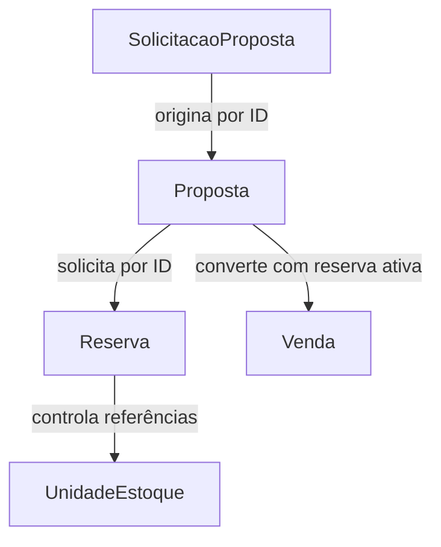

# Agregados e invariantes

Este documento consolida a `BKL-006` do Maikeise MotoHub. Ele transforma os eventos descobertos na `BKL-005` em um modelo tático inicial, identificando Aggregate Roots, entidades internas, Value Objects, invariantes e fronteiras de persistência.

O modelo ainda é independente de JPA, banco de dados e interface web. Anotações, tabelas, relacionamentos de persistência e pacotes Java serão definidos depois da decisão arquitetural da `BKL-007`.

> [!TIP]
> A visão geral das raízes e o diagrama são suficientes para a primeira leitura. Os detalhes de cada contexto estão recolhidos e continuam disponíveis como referência para implementação e estudo.

## Resumo executivo

- O modelo possui 11 Aggregate Roots distribuídas entre seis Bounded Contexts.
- `UnidadeEstoque` e `Reserva` são separadas, mas a criação integral ocorre em uma transação local.
- `Proposta` controla suas versões; `Venda` nasce como um registro definitivo.
- Agregados se referenciam por IDs tipados e somente raízes possuem repositórios.
- Value Objects validam conceitos como CPF, CNPJ, dinheiro, desconto e chassi.
- Unicidades globais recebem proteção no caso de uso e no banco.

## Objetivos

- Definir quais objetos controlam cada mudança de estado.
- Delimitar as unidades de consistência do domínio.
- Evitar agregados grandes e grafos de objetos entre contextos.
- Associar invariantes aos objetos responsáveis por protegê-las.
- Identificar regras que dependem de repositório, transação ou coordenação.
- Preparar a implementação orientada pela Arquitetura Hexagonal.

## Conceitos utilizados

| Conceito | Significado neste projeto |
| --- | --- |
| Entidade | Objeto reconhecido por sua identidade e que mantém continuidade mesmo quando seus atributos mudam. |
| Value Object | Objeto imutável definido por seus valores, sem identidade própria. Valida-se ao ser criado. |
| Agregado | Conjunto de objetos alterado como uma unidade de consistência. |
| Aggregate Root | Entidade que representa a única porta autorizada para alterar o agregado. |
| Invariante | Regra que precisa continuar verdadeira após toda operação válida. |
| Repositório | Porta usada para recuperar e persistir Aggregate Roots sem expor a tecnologia de armazenamento. |
| Serviço de aplicação | Coordenador de um caso de uso, de transações, repositórios e portas externas. |
| Serviço de domínio | Componente para uma regra de negócio que não pertence naturalmente a uma única entidade ou Value Object. |

Uma Aggregate Root não é automaticamente uma tabela, um módulo ou um microsserviço. Um Bounded Context pode possuir várias raízes.

## Regras gerais de modelagem

1. Toda alteração entra pelo comportamento da Aggregate Root; não haverá alteração pública e irrestrita de campos.
2. Entidades internas e Value Objects não possuem repositórios próprios.
3. Um agregado referencia outro por um identificador tipado, nunca por uma associação de entidades.
4. Objetos de contextos diferentes não formam um único agregado nem uma associação JPA.
5. Value Objects são imutáveis e impedem a criação de valores inválidos.
6. Somente Aggregate Roots possuem interfaces de repositório.
7. Regras globais de unicidade usam consulta prévia para uma mensagem clara e restrição no banco para proteção concorrente.
8. Horários de negócio são recebidos por uma abstração de relógio; o domínio não chama o relógio do sistema de forma escondida.
9. Eventos de domínio são produzidos depois de uma mudança válida de estado.
10. Detalhes técnicos como ORM, lock, outbox e scheduler não entram nas entidades do domínio.

## Visão geral dos Aggregate Roots

| Bounded Context | Aggregate Root | Responsabilidade principal |
| --- | --- | --- |
| Identity and Access | `ContaAcesso` | Credenciais, situação da conta e papéis. |
| Identity and Access | `ConviteFuncionario` | Convite de uso único anterior à criação da conta interna. |
| Customer Management | `Cliente` | Perfil PF ou PJ, situação comercial e vínculos de representantes. |
| Catalog | `ModeloMotocicleta` | Informações compartilhadas de marca, modelo, versão e especificações. |
| Catalog | `Anuncio` | Conteúdo comercial, preço, fotos e representação pública da disponibilidade. |
| Inventory and Reservation | `UnidadeEstoque` | Identidade física e ciclo operacional da motocicleta. |
| Inventory and Reservation | `Reserva` | Exclusividade temporária, prazo e encerramento de um conjunto de unidades. |
| Commercial | `SolicitacaoProposta` | Pedido inicial e acompanhamento até seu atendimento ou cancelamento. |
| Commercial | `Proposta` | Versões, desconto, validade, decisão do cliente e confirmação do pagamento externo. |
| Commercial | `Venda` | Registro comercial definitivo e seu eventual cancelamento compensatório. |
| Audit | `RegistroAuditoria` | Evidência imutável e segura de um acontecimento auditável. |

## Relações no fluxo principal



As setas representam referências e coordenação, não composição de agregados. Cada raiz preserva seu próprio ciclo de vida.

<details>
<summary><strong>Identity and Access</strong></summary>

### Aggregate Root `ContaAcesso`

#### Estado controlado

- `ContaId`.
- `EmailAcesso` único.
- `SenhaProtegida`.
- `TipoConta`: cliente ou funcionário.
- Conjunto de `PapelAcesso`.
- Situação: `PENDENTE_CONFIRMACAO`, `ATIVA`, `BLOQUEADA` ou `DESATIVADA`.
- Dados da confirmação ou da alteração de e-mail.

Papéis internos iniciais incluem `RESPONSAVEL_ESTOQUE`, `VENDEDOR`, `GERENTE` e `ADMINISTRADOR`. Contas externas recebem um papel básico de cliente; a autorização para agir por uma empresa continua em `Customer Management`.

#### Comportamentos

- Criar conta de cliente pendente.
- Confirmar e-mail e ativar conta.
- Solicitar e confirmar alteração de e-mail.
- Atribuir ou remover papel por ação administrativa autorizada.
- Bloquear, desbloquear ou desativar.
- Substituir a senha protegida.

#### Invariantes

| Código | Invariante |
| --- | --- |
| INV-IAM-001 | O e-mail de acesso deve possuir formato válido. |
| INV-IAM-002 | Uma conta pendente não realiza operações comerciais. |
| INV-IAM-003 | Uma conta não concede nem remove os próprios privilégios. |
| INV-IAM-004 | Senha legível nunca é mantida no estado persistido. |
| INV-IAM-005 | Uma conta desativada não pode ser autenticada. |

A unicidade do e-mail depende de consulta ao repositório e restrição única no banco, pois uma conta isolada não conhece todas as outras.

### Aggregate Root `ConviteFuncionario`

#### Estado controlado

- `ConviteFuncionarioId`.
- `EmailAcesso` convidado.
- Papel inicial pretendido.
- `ContaId` do administrador responsável.
- Token armazenado de forma protegida.
- Instantes de criação e expiração.
- Situação: `PENDENTE`, `ACEITO`, `EXPIRADO` ou `CANCELADO`.

#### Invariantes

| Código | Invariante |
| --- | --- |
| INV-IAM-006 | Somente convite pendente e dentro do prazo pode ser aceito. |
| INV-IAM-007 | Um convite é aceito no máximo uma vez. |
| INV-IAM-008 | Aceitar, expirar ou cancelar encerra definitivamente o convite. |
| INV-IAM-009 | O token legível não é armazenado nem enviado para auditoria. |

O convite existe antes da conta do funcionário e, por isso, possui ciclo de vida e repositório próprios.

</details>

<details>
<summary><strong>Customer Management</strong></summary>

### Aggregate Root `Cliente`

`Cliente` possui exatamente um perfil interno representado por Value Object:

- `DadosPessoaFisica`, com nome, `Cpf` e data de nascimento; ou
- `DadosPessoaJuridica`, com razão social e `Cnpj`.

Campos comuns incluem `ClienteId`, telefone, endereço opcional, situação comercial e referências às contas autorizadas.

#### Entidade interna `VinculoRepresentante`

Um cliente PJ mantém uma coleção de vínculos. Cada vínculo possui:

- `RepresentanteId`.
- `ContaId`.
- Data de início.
- Data de encerramento opcional.
- Situação ativa ou encerrada.

Uma mesma conta pode possuir vínculos explícitos com clientes PJ diferentes. O vínculo, e não um papel genérico da conta, determina por qual empresa a pessoa pode agir.

#### Value Objects principais

- `ClienteId`.
- `Cpf`.
- `Cnpj`.
- `Telefone`.
- `Endereco`.
- `MotivoBloqueio`.
- `MotivoCorrecaoDocumento`.

#### Comportamentos

- Cadastrar PF ou PJ por fábricas explícitas.
- Completar dados e habilitar comercialmente.
- Atualizar telefone e endereço.
- Corrigir documento mediante ação gerencial justificada.
- Vincular ou encerrar representante.
- Bloquear ou reativar comercialmente.

#### Invariantes

| Código | Invariante |
| --- | --- |
| INV-CUS-001 | Um cliente possui exatamente um perfil: PF ou PJ. |
| INV-CUS-002 | CPF e CNPJ precisam ser matematicamente válidos. |
| INV-CUS-003 | PF precisa ter pelo menos 18 anos para ser habilitada no MVP. |
| INV-CUS-004 | PJ ativa precisa possuir ao menos um representante ativo. |
| INV-CUS-005 | O último representante de uma PJ ativa não pode ser encerrado. |
| INV-CUS-006 | Um vínculo ativo não pode ser duplicado para a mesma conta e empresa. |
| INV-CUS-007 | CPF ou CNPJ somente é corrigido por operação gerencial justificada. |
| INV-CUS-008 | Cliente bloqueado não inicia novas negociações. |

A unicidade global de CPF e CNPJ é protegida por repositório e banco. O agregado protege formato, transições e vínculos internos.

</details>

<details>
<summary><strong>Catalog</strong></summary>

### Aggregate Root `ModeloMotocicleta`

#### Estado controlado

- `ModeloMotocicletaId`.
- Marca, nome do modelo e versão.
- Especificações públicas.

O modelo descreve um produto compartilhado. Ele não conhece unidades físicas, reservas ou vendas.

#### Invariantes

| Código | Invariante |
| --- | --- |
| INV-CAT-001 | Marca, modelo e versão não podem ser vazios. |

### Aggregate Root `Anuncio`

#### Estado controlado

- `AnuncioId`.
- `ModeloMotocicletaId`.
- `UnidadeId` externa ao contexto.
- Descrição comercial.
- `PrecoAnunciado`.
- Coleção de `FotoAnuncio`.
- Situação editorial: `RASCUNHO`, `PUBLICADO` ou `ARQUIVADO`.
- Disponibilidade pública: `DISPONIVEL`, `RESERVADA` ou `INDISPONIVEL`.

`FotoAnuncio` será uma entidade interna com `FotoId`, localização do arquivo, ordem e legenda opcional. Ela não possui repositório próprio.

#### Comportamentos

- Criar e editar rascunho.
- Adicionar, remover ou reordenar fotos.
- Publicar ou arquivar.
- Alterar preço oficial.
- Refletir disponibilidade recebida de `Inventory and Reservation`.

#### Invariantes

| Código | Invariante |
| --- | --- |
| INV-CAT-002 | Preço publicado deve ser maior que zero. |
| INV-CAT-003 | Anúncio somente é publicado com dados mínimos completos. |
| INV-CAT-004 | Anúncio arquivado não pode voltar a ser selecionável por uma edição comum. |
| INV-CAT-005 | Disponibilidade pública não concede autoridade para reservar a unidade. |
| INV-CAT-006 | Alterar o preço não reescreve snapshots de propostas existentes. |

Cada unidade possui no máximo um anúncio não arquivado. Essa unicidade é global e recebe proteção do repositório e do banco.

Situação editorial e disponibilidade são dimensões separadas. Um anúncio pode estar `PUBLICADO` e, ao mesmo tempo, representar uma unidade `RESERVADA`.

</details>

<details>
<summary><strong>Inventory and Reservation</strong></summary>

### Aggregate Root `UnidadeEstoque`

#### Estado controlado

- `UnidadeId`.
- `ModeloMotocicletaId` externo ao contexto.
- `NumeroChassi`.
- `NumeroMotor` opcional.
- `Placa` opcional.
- Ano, cor e características físicas.
- Situação operacional.
- `ReservaId` ativa, quando reservada.

#### Situações

```text
EM_PREPARACAO
DISPONIVEL
RESERVADA
VENDIDA
EM_REVISAO
FORA_DE_VENDA
```

#### Comportamentos

- Confirmar preparação.
- Reservar para uma `ReservaId`.
- Liberar da reserva correspondente.
- Marcar como vendida pela reserva correspondente.
- Colocar em revisão.
- Liberar para venda ou retirar de venda após revisão.

#### Invariantes

| Código | Invariante |
| --- | --- |
| INV-INR-001 | Somente unidade `DISPONIVEL` pode ser reservada. |
| INV-INR-002 | Uma unidade possui no máximo uma `ReservaId` ativa. |
| INV-INR-003 | Somente a reserva vinculada pode liberar ou vender a unidade. |
| INV-INR-004 | Unidade `VENDIDA` não volta diretamente para `DISPONIVEL`. |
| INV-INR-005 | Unidade `EM_REVISAO` exige liberação explícita para voltar à venda. |
| INV-INR-006 | Chassi não pode ser vazio nem inválido segundo o formato adotado. |

Chassi, motor e placa possuem unicidade global protegida também no banco.

### Aggregate Root `Reserva`

#### Estado controlado

- `ReservaId`.
- `ClienteId` externo ao contexto.
- `PropostaId` e `VersaoPropostaId` externos ao contexto.
- Conjunto não vazio de `UnidadeId`.
- Instantes de criação e vencimento.
- Situação: `ATIVA`, `CANCELADA`, `EXPIRADA` ou `UTILIZADA`.
- Registro opcional da única prorrogação.
- Registro opcional de cancelamento.

A reserva não contém entidades completas de cliente, proposta ou unidade e não possui valores comerciais.

#### Comportamentos

- Criar com prazo inicial de 48 horas.
- Prorrogar uma única vez por 24 horas.
- Cancelar pelo cliente.
- Cancelar internamente com motivo.
- Expirar pela passagem do tempo.
- Utilizar na conclusão da venda.

#### Invariantes

| Código | Invariante |
| --- | --- |
| INV-INR-007 | Uma reserva possui ao menos uma unidade e não repete `UnidadeId`. |
| INV-INR-008 | Cliente, proposta, versão e conjunto de unidades não mudam depois da criação. |
| INV-INR-009 | Somente reserva `ATIVA` pode ser prorrogada, cancelada, expirada ou utilizada. |
| INV-INR-010 | A prorrogação ocorre no máximo uma vez, antes do vencimento, por gerente e com justificativa. |
| INV-INR-011 | A prorrogação acrescenta exatamente 24 horas ao prazo aplicável. |
| INV-INR-012 | Reserva utilizada, cancelada ou expirada não é reaberta. |
| INV-INR-013 | Todas as unidades são reservadas ou liberadas juntas. |
| INV-INR-014 | Prorrogação e utilização somente podem ocorrer antes do instante de vencimento. |
| INV-INR-015 | A expiração somente pode ocorrer quando o instante de vencimento for alcançado. |

`PRORROGADA` não é uma situação: a reserva continua `ATIVA` com novo vencimento. `RECUSADA` não é uma situação porque, quando a tentativa falha, nenhuma reserva é criada.

### Coordenação atômica da reserva

`CriarReserva` é um serviço de aplicação do próprio contexto:

1. Recebe identificadores de cliente, proposta e unidades já validados pelo fluxo.
2. Ordena os `UnidadeId` de forma estável para reduzir risco de deadlock.
3. Carrega e bloqueia as unidades pela estratégia definida na arquitetura.
4. Confirma que todas estão `DISPONIVEL`.
5. Se uma falhar, encerra sem modificar nenhuma delas.
6. Cria a `Reserva` e solicita a cada `UnidadeEstoque` que se reserve para sua `ReservaId`.
7. Persiste todas as raízes em uma única transação local.

Não será criado um agregado gigante `Estoque`. A operação atualiza várias raízes porque a regra atômica envolve várias unidades, mas todas permanecem no mesmo Bounded Context e na mesma transação local.

</details>

<details>
<summary><strong>Commercial</strong></summary>

### Aggregate Root `SolicitacaoProposta`

#### Estado controlado

- `SolicitacaoPropostaId`.
- `ClienteId`.
- Conjunto não vazio de `UnidadeId`.
- Instantes de criação e atualização.
- Situação: `RECEBIDA`, `EM_ANALISE`, `ATENDIDA` ou `CANCELADA`.

#### Invariantes

| Código | Invariante |
| --- | --- |
| INV-COM-001 | A solicitação possui um cliente e ao menos uma unidade sem repetições. |
| INV-COM-002 | Solicitação atendida ou cancelada não volta para análise. |
| INV-COM-003 | Criar a proposta não altera as unidades selecionadas da solicitação original. |

### Aggregate Root `Proposta`

#### Estado controlado

- `PropostaId`.
- `SolicitacaoPropostaId`.
- `ClienteId`.
- Coleção de entidades `VersaoProposta`.
- Identificador da versão atual.
- Situação comercial da proposta.
- `ReservaId` quando confirmada.
- `ConfirmacaoPagamentoExterno` opcional e imutável.

#### Entidade interna `VersaoProposta`

Cada versão possui:

- `VersaoPropostaId` e número sequencial.
- Conjunto de `ItemProposta` com `UnidadeId`, descrição e preço capturados.
- `ValorBruto`, `PercentualDesconto` e `ValorFinal`.
- Condições comerciais.
- Análise de desconto vinculada àquela versão.
- Instantes de criação, envio e validade.
- Situação da versão.

`ItemProposta`, valores monetários, percentual e período de validade são Value Objects. `AnaliseDesconto` será uma entidade interna porque possui solicitação, decisão, responsáveis e ciclo próprio dentro da versão.

#### Comportamentos

- Criar nova versão e substituir a anterior.
- Calcular valor bruto, desconto global e valor final.
- Solicitar, aprovar ou rejeitar desconto especial.
- Liberar e enviar a versão atual.
- Aceitar, recusar ou expirar.
- Associar a reserva confirmada.
- Registrar a confirmação do pagamento externo.
- Converter em venda.

#### Invariantes

| Código | Invariante |
| --- | --- |
| INV-COM-004 | Somente uma versão é atual e apta a seguir no fluxo. |
| INV-COM-005 | O conteúdo comercial de versões enviadas e substituídas permanece imutável; apenas seu estado de ciclo de vida pode avançar. |
| INV-COM-006 | Valor bruto é a soma dos preços capturados dos itens. |
| INV-COM-007 | Valor final é o valor bruto menos o desconto global válido. |
| INV-COM-008 | Desconto acima de 10% exige aprovação gerencial da versão exata. |
| INV-COM-009 | Alterar preço, item, desconto ou condição cria nova versão e invalida aprovação anterior. |
| INV-COM-010 | Somente versão atual, enviada e dentro dos sete dias pode ser aceita. |
| INV-COM-011 | Aceite, recusa e expiração são mutuamente exclusivos para a versão. |
| INV-COM-012 | Pagamento externo somente é confirmado para proposta aceita com reserva associada. |
| INV-COM-013 | Uma proposta é convertida em no máximo uma venda. |

O limite máximo de desconto aprovável pelo gerente permanece uma decisão aberta. O agregado terá uma política explícita, sem espalhar números mágicos pelo código.

### Value Object `ConfirmacaoPagamentoExterno`

Contém forma de pagamento, instante da confirmação, `ContaId` do funcionário e referência externa opcional. É imutável e não armazena cartão, conta bancária nem comprovante completo.

### Aggregate Root `Venda`

#### Estado controlado

- `VendaId`.
- `ClienteId`, `PropostaId`, `VersaoPropostaId` e `ReservaId`.
- `SnapshotVenda` imutável.
- Instante e funcionário que concluiu.
- Situação: `CONCLUIDA` ou `CANCELADA`.
- Dados do cancelamento, quando existir.

O snapshot contém unidades, descrições, valores, desconto, condições e confirmação do pagamento utilizados na conclusão.

#### Comportamentos e invariantes

| Código | Invariante |
| --- | --- |
| INV-COM-014 | A venda nasce `CONCLUIDA`; não existe venda preliminar no domínio. |
| INV-COM-015 | Toda venda referencia proposta aceita, reserva utilizada e pagamento confirmado. |
| INV-COM-016 | O snapshot não muda depois da criação. |
| INV-COM-017 | Uma reserva origina no máximo uma venda. |
| INV-COM-018 | Somente gerente cancela uma venda concluída e informa motivo. |
| INV-COM-019 | Venda cancelada não é reaberta nem apagada. |

Concluir a venda exige coordenação entre `Commercial` e `Inventory and Reservation`. O modelo define as pré-condições; idempotência, ordem de persistência, falha intermediária e compensação técnica pertencem à `BKL-007`.

</details>

<details>
<summary><strong>Audit</strong></summary>

### Aggregate Root `RegistroAuditoria`

#### Estado controlado

- `RegistroAuditoriaId`.
- Contexto e tipo do acontecimento.
- Identificador seguro do objeto afetado.
- `ContaId` ou ator `SYSTEM`.
- Data, horário e resultado.
- Justificativa e metadados estritamente necessários.

#### Invariantes

| Código | Invariante |
| --- | --- |
| INV-AUD-001 | O registro é imutável depois de criado. |
| INV-AUD-002 | Todo registro possui origem, acontecimento e instante. |
| INV-AUD-003 | Ações humanas identificam a conta responsável; automações identificam `SYSTEM`. |
| INV-AUD-004 | Senhas, tokens, dados bancários e dados pessoais desnecessários são rejeitados. |
| INV-AUD-005 | Audit não altera nem decide o estado do contexto de origem. |

Cada registro é uma raiz pequena e independente. Seu repositório oferece inclusão e consultas autorizadas, não uma operação comum de edição.

</details>

<details>
<summary><strong>Repositórios, IDs, serviços e consistência</strong></summary>

## Catálogo de repositórios

| Bounded Context | Porta de repositório | Aggregate Root retornada |
| --- | --- | --- |
| Identity and Access | `ContaAcessoRepository` | `ContaAcesso` |
| Identity and Access | `ConviteFuncionarioRepository` | `ConviteFuncionario` |
| Customer Management | `ClienteRepository` | `Cliente` |
| Catalog | `ModeloMotocicletaRepository` | `ModeloMotocicleta` |
| Catalog | `AnuncioRepository` | `Anuncio` |
| Inventory and Reservation | `UnidadeEstoqueRepository` | `UnidadeEstoque` |
| Inventory and Reservation | `ReservaRepository` | `Reserva` |
| Commercial | `SolicitacaoPropostaRepository` | `SolicitacaoProposta` |
| Commercial | `PropostaRepository` | `Proposta` |
| Commercial | `VendaRepository` | `Venda` |
| Audit | `RegistroAuditoriaRepository` | `RegistroAuditoria` |

Não existirão repositórios para `VersaoProposta`, `FotoAnuncio`, `VinculoRepresentante`, `ItemProposta` ou qualquer Value Object.

As interfaces são portas do núcleo. Adaptadores de persistência poderão usar Spring Data JPA internamente, sem fazer o domínio depender de `JpaRepository`.

## IDs tipados e Value Objects

Identificadores como `ClienteId`, `PropostaId`, `ReservaId`, `UnidadeId` e `ContaId` encapsulam o valor técnico subjacente. Isso impede que IDs semanticamente diferentes sejam trocados por engano mesmo quando todos utilizarem UUID.

Value Objects previstos incluem:

| Área | Exemplos |
| --- | --- |
| Identificação | `Cpf`, `Cnpj`, `EmailAcesso`, `NumeroChassi`, `NumeroMotor`, `Placa`. |
| Contato | `Telefone`, `Endereco`. |
| Comercial | `PrecoAnunciado`, `ValorBruto`, `ValorFinal`, `PercentualDesconto`, `ItemProposta`, `SnapshotVenda`. |
| Tempo e justificativa | `PeriodoValidade`, `MotivoCancelamento`, `MotivoBloqueio`, `ProrrogacaoReserva`. |
| Segurança | `SenhaProtegida`, `PapelAcesso`. |

Cada contexto controla seus próprios tipos e significados. A existência de valores monetários em `Catalog` e `Commercial` não autoriza um Shared Kernel automático entre os contextos.

Quando um ID atravessar um limite, ele será publicado em um contrato estável. O contexto consumidor poderá convertê-lo para um tipo de referência local; ele não importará a entidade nem o pacote de domínio do contexto proprietário. A forma exata desse contrato será decidida na `BKL-007`.

## Serviços de aplicação e serviços de domínio

### Serviços de aplicação previstos

- Criar conta e cadastro do cliente, coordenando contextos por portas.
- Criar reserva integral em uma transação local de `Inventory and Reservation`.
- Concluir venda, coordenando proposta e utilização da reserva.
- Cancelar venda e solicitar revisão das unidades.
- Processar expiração de proposta e reserva.

O serviço de aplicação decide a ordem do caso de uso, abre a transação adequada, carrega Aggregate Roots, chama comportamentos e persiste os resultados. Ele não contém setters para contornar o domínio.

### Serviços de domínio

Somente serão criados quando uma regra verdadeiramente não couber em uma raiz ou Value Object. Cálculo do total e validação da alçada pertencem à `Proposta`; transições de unidade pertencem à `UnidadeEstoque`. Não será criado um “serviço” para cada método do domínio.

## Consistência, concorrência e restrições globais

| Regra | Proteção no modelo | Proteção adicional |
| --- | --- | --- |
| E-mail único | `EmailAcesso` válido e consulta antes da criação | Restrição única no banco. |
| CPF ou CNPJ único | Value Object válido e consulta ao cliente | Restrições únicas no banco. |
| Chassi, motor e placa únicos | Value Objects válidos e consulta à unidade | Restrições únicas no banco. |
| Um anúncio ativo por unidade | Regra do caso de uso | Restrição única condicional ou estratégia equivalente. |
| Uma reserva ativa por unidade | Transição protegida por `UnidadeEstoque` | Lock ou controle de versão e transação local. |
| Uma venda por reserva | Invariante de `Venda` e idempotência do caso de uso | Restrição única por `reservaId`. |

A consulta prévia melhora a mensagem apresentada ao usuário, mas não substitui a restrição do banco: duas solicitações podem passar pela consulta ao mesmo tempo.

## Fronteiras transacionais iniciais

- Alterar uma única Aggregate Root ocorre em uma transação local do contexto proprietário.
- Criar uma reserva de várias unidades atualiza `Reserva` e várias `UnidadeEstoque` na mesma transação local.
- Criar uma nova versão atualiza somente a raiz `Proposta`, pois as versões são internas.
- Concluir uma venda toca raízes de dois contextos e não utilizará transação distribuída; a coordenação confiável será decidida na `BKL-007`.
- Atualizar catálogo e auditoria a partir de eventos aceita consistência eventual.

</details>

## Decisões evitadas deliberadamente

- Um agregado `Estoque` contendo todas as unidades.
- Uma entidade `Cliente` com todos os campos PF e PJ opcionais e sem perfil explícito.
- `VersaoProposta` como Aggregate Root independente.
- Repositórios para entidades internas ou Value Objects.
- Objetos completos de outros contextos dentro de um agregado.
- Associações JPA atravessando módulos.
- Setters públicos como mecanismo principal de alteração.
- Um Shared Kernel de entidades ou Value Objects entre os contextos.
- Transformar entrega de e-mail em agregado de negócio antes da decisão arquitetural.

## Pontos encaminhados para a BKL-007

- Estrutura de módulos e pacotes da Arquitetura Hexagonal.
- Mapeamento entre objetos de domínio e entidades de persistência.
- Estratégia de lock ou versionamento para unidades concorrentes.
- Coordenação entre criação de conta e cadastro de cliente.
- Coordenação, idempotência e compensação entre utilização da reserva e venda.
- Transactional Outbox e entrega confiável de eventos.
- Scheduler para expirações e repetição de notificações.
- Serialização de IDs tipados nas APIs e no banco.
- Limites das transações Spring.

O desconto máximo que nem o gerente pode aprovar continua sendo uma decisão de domínio aberta e não será inventado pela arquitetura.

<details>
<summary><strong>Estratégia de testes derivada do modelo</strong></summary>

- Cada invariante recebe ao menos um teste unitário no objeto que a protege.
- Cada transição válida e inválida de situação recebe teste.
- Value Objects recebem testes de construção, igualdade e imutabilidade.
- Criação atômica de reservas concorrentes recebe teste de integração com banco real por Testcontainers.
- Restrições únicas recebem testes de integração.
- Coordenações entre contextos recebem testes de aplicação e de contrato.
- Repetição da conclusão da venda recebe teste de idempotência.

</details>

## Resultado da BKL-006

A atividade é considerada concluída porque:

- cada contexto possui Aggregate Roots explícitas;
- entidades internas e Value Objects possuem proprietários claros;
- invariantes foram associadas aos objetos que devem protegê-las;
- referências entre agregados utilizam IDs tipados;
- repositórios existem somente para raízes;
- regras globais e concorrentes possuem uma estratégia de proteção em camadas;
- a reserva integral possui fronteira transacional explícita;
- dúvidas técnicas foram preservadas para a ADR em vez de contaminarem o modelo de domínio.

## O que registrar no caderno

- Aggregate Root é a única porta de alteração do agregado.
- Outros agregados são referenciados por IDs, não por grafos de entidades.
- Entidades internas e Value Objects não possuem repositórios próprios.
- Serviço de aplicação coordena o caso de uso; Aggregate Roots protegem as regras.
- Consulta de unicidade melhora o erro, mas a restrição do banco protege contra concorrência.
- Um agregado deve ser tão pequeno quanto possível e tão grande quanto necessário para manter suas invariantes.
- Modelar agregados não significa escolher tabelas ou microsserviços.

## Próximo passo

A `BKL-007` registrará a decisão arquitetural inicial: monólito modular, Arquitetura Hexagonal, regras de dependência, transações, eventos confiáveis e critérios para uma futura extração de microsserviços.

[Voltar ao resumo do DDD](00-overview.md).
