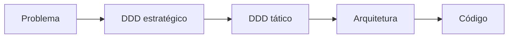

# Modelagem DDD

Esta pasta registra como o domínio do Maikeise MotoHub foi descoberto e transformado em um modelo pronto para orientar a arquitetura.

> [!TIP]
> Para uma primeira leitura, comece por [DDD em uma visão](00-overview.md). Os demais arquivos funcionam como memória das decisões e material de estudo.

## Progresso

| Atividade | Resultado | Situação |
| --- | --- | --- |
| `BKL-001` | Linguagem ubíqua | ✅ Concluída |
| `BKL-002` | Subdomínios | ✅ Concluída |
| `BKL-003` | Bounded Contexts | ✅ Concluída |
| `BKL-004` | Context Map | ✅ Concluída |
| `BKL-005` | Eventos de domínio | ✅ Concluída |
| `BKL-006` | Agregados e invariantes | ✅ Concluída |
| `BKL-007` | Decisão arquitetural inicial | ✅ Concluída |

## Documentos

| Ordem | Documento | Pergunta respondida | Profundidade |
| ---: | --- | --- | --- |
| 0 | [DDD em uma visão](00-overview.md) | Como todo o modelo se conecta? | Resumo |
| 1 | [Subdomínios](01-subdomains.md) | Quais capacidades são Core, Supporting ou Generic? | Estratégica |
| 2 | [Bounded Contexts](02-bounded-contexts.md) | Onde cada modelo começa e termina? | Estratégica |
| 3 | [Context Map](03-context-map.md) | Como os contextos dependem e conversam entre si? | Estratégica |
| 4 | [Eventos de domínio](04-domain-events.md) | O que acontece ao longo do fluxo comercial? | Estratégica e comportamental |
| 5 | [Agregados e invariantes](05-aggregates-and-invariants.md) | Quem protege cada regra dentro do código? | Tática |
| 6 | [Arquitetura](../architecture/00-overview.md) | Como o modelo será transformado em uma aplicação? | Solução |

## Estratégico e tático

O **DDD estratégico** organiza o espaço do problema: subdomínios, contextos e relações. O **DDD tático** modela o interior de cada contexto: entidades, Value Objects, agregados, repositórios e serviços.

Essa ordem é intencional. Arquitetura e framework devem servir ao modelo, e não definir o negócio antes de ele ser compreendido.

## Resultado atual

O modelo possui seis Bounded Contexts e onze Aggregate Roots. As decisões mais importantes são:

- `Commercial` e `Inventory and Reservation` concentram o fluxo Core.
- Catálogo não decide disponibilidade; ele apresenta uma projeção pública.
- Estoque e reservas compartilham um contexto para preservar exclusividade e atomicidade.
- Propostas preservam versões; vendas preservam snapshots.
- Agregados se referenciam por IDs tipados.
- Somente Aggregate Roots possuem repositórios.
- Auditoria e atualização do catálogo aceitam consistência eventual.
- Os contextos não compartilham entidades, associações JPA ou tabelas como contrato.

## Direção de arquitetura

A decisão aceita é um **monólito modular**, com um módulo por Bounded Context e Arquitetura Hexagonal dentro de cada módulo. Sua justificativa, seus trade-offs e seus mecanismos estão na [ADR-001](../architecture/decisions/ADR-001-monolito-modular-arquitetura-hexagonal.md).

Microsserviços continuam sendo uma possibilidade de evolução, não um objetivo antecipado. Uma extração só fará sentido quando existir necessidade concreta de escala, autonomia ou implantação independente.

<strong>Critérios usados para considerar o modelo pronto</strong>

- Cada contexto possui responsabilidade e vocabulário claros.
- As principais invariantes estão ligadas a agregados.
- Integrações síncronas e assíncronas estão explícitas.
- Decisões ainda abertas permanecem registradas.
- O modelo não depende de JPA, HTTP ou uma interface específica.
- A arquitetura foi derivada de evidências do domínio, e não da preferência por um framework.

## Próximo passo

A fundação técnica começará pela `BKL-010`: gerar o projeto Spring Boot, configurar o build reproduzível e criar o esqueleto dos módulos aprovados.

[Voltar ao Hub da documentação](../README.md).
